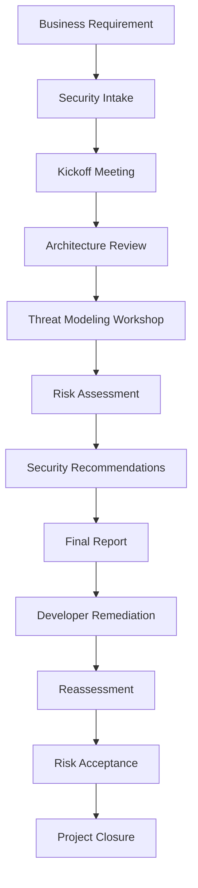

# 🛡️ Enterprise Threat Modeling Playbook

### Design Secure Systems • Reduce Risk • Build Security by Design

---

## 🎯 Why This Repository Exists

Most public Threat Modeling resources explain **individual methodologies** such as STRIDE or PASTA.

Very few explain how Threat Modeling is actually performed in enterprise environments.

Questions commonly faced by engineers include:

- How does a project begin?
- When should Threat Modeling be performed?
- Who should attend the workshop?
- What documents are required?
- How are risks prioritized?
- What does the final report look like?
- How are findings tracked?
- When is reassessment required?
- What happens after remediation?

This repository answers those questions by documenting the complete enterprise Threat Modeling lifecycle—from project initiation to project closure.

It focuses on practical guidance rather than theory alone.

## 🚀 What You'll Learn

| Domain | Coverage |
|---------|----------|
| Enterprise Threat Modeling | ✅ |
| Security Architecture Review | ✅ |
| Risk Assessment | ✅ |
| STRIDE | ✅ |
| PASTA | ✅ |
| Attack Trees | ✅ |
| Secure SDLC | ✅ |
| DevSecOps Integration | ✅ |
| Cloud Threat Modeling | ✅ |
| Kubernetes | ✅ |
| API Security | ✅ |
| IAM | ✅ |
| Security Controls | ✅ |
| Reporting | ✅ |
| Templates | ✅ |
| Governance | ✅ |
| Metrics & KPIs | ✅ |
| Real Enterprise Examples | ✅ |

## 🏢 Enterprise Threat Modeling Lifecycle

## 📚 Repository Overview

| Section | Description |
|---------|-------------|
| 📘 Getting Started | Learn Threat Modeling fundamentals |
| 🏗 Security Architecture | Architecture review process |
| 🔒 Threat Modeling | STRIDE, PASTA, VAST, LINDDUN |
| 📊 Risk Assessment | Risk analysis and prioritization |
| ☁ Cloud Security | AWS, Azure, GCP |
| ⚙ DevSecOps | SDLC integration |
| 📄 Templates | Reports, checklists and workbooks |
| 🧪 Case Studies | Real enterprise examples |
| 📚 References | Standards and frameworks |

