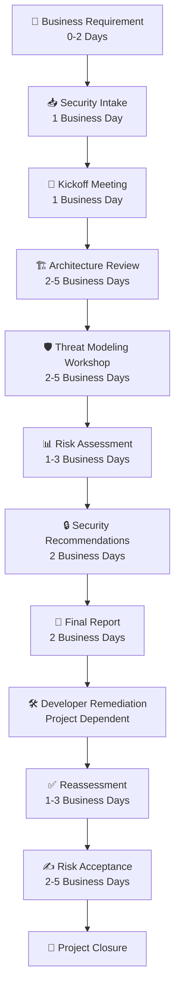

# 🛡️ Enterprise Threat Modeling Playbook

### Design Secure Systems • Reduce Risk • Build Security by Design

---

## 🎯 Why This Repository Exists

Most public Threat Modeling resources explain **individual methodologies** such as STRIDE or PASTA.

Very few explain how Threat Modeling is actually performed in enterprise environments.

Questions commonly faced by engineers include:

- How does a project begin?
- When should Threat Modeling be performed?
- Who should attend the workshop?
- What documents are required?
- How are risks prioritized?
- What does the final report look like?
- How are findings tracked?
- When is reassessment required?
- What happens after remediation?

This repository answers those questions by documenting the complete enterprise Threat Modeling lifecycle—from project initiation to project closure.

It focuses on practical guidance rather than theory alone.

## 🚀 What You'll Learn

| Domain | Coverage |
|---------|----------|
| Enterprise Threat Modeling | ✅ |
| Security Architecture Review | ✅ |
| Risk Assessment | ✅ |
| STRIDE | ✅ |
| PASTA | ✅ |
| Attack Trees | ✅ |
| Secure SDLC | ✅ |
| DevSecOps Integration | ✅ |
| Cloud Threat Modeling | ✅ |
| Kubernetes | ✅ |
| API Security | ✅ |
| IAM | ✅ |
| Security Controls | ✅ |
| Reporting | ✅ |
| Templates | ✅ |
| Governance | ✅ |

# 🏢 Enterprise Threat Modeling Project Lifecycle

---

# Stage Details

| Stage | Objective | Typical SLA* | Primary Participants | Key Deliverable |
|---------|------------|-------------|----------------------|-----------------|
| Business Requirement | Identify new project/change | 0–2 days | Business Owner | Security request |
| Security Intake | Register project | 1 business day | Security Team | Intake record |
| Kickoff Meeting | Understand project | 1 business day | All stakeholders | Scope & action items |
| Architecture Review | Review architecture | 2–5 business days | Security Architect | Architecture observations |
| Threat Modeling Workshop | Identify threats | 2–5 business days | Security + Engineering | Threat register |
| Risk Assessment | Prioritize risks | 1–3 business days | Security Team | Risk matrix |
| Security Recommendations | Recommend controls | 2 business days | Security Architect | Recommendations |
| Final Report | Publish findings | 2 business days | Security Team | Final report |
| Developer Remediation | Implement fixes | Depends on project | Development Team | Remediation evidence |
| Reassessment | Validate fixes | 1–3 business days | Security Team | Reassessment report |
| Risk Acceptance | Accept residual risk (if applicable) | 2–5 business days | Risk Owner | Risk acceptance |
| Project Closure | Complete review | 1 day | Security Team | Closure record |

> *Example SLAs. Organizations should define their own based on project complexity and governance.

---

# 1️⃣ Business Requirement

## Objective

Identify a new application, feature, integration, or architectural change requiring security review.

### Typical Triggers

- New application
- New API
- Cloud migration
- Authentication redesign
- Internet exposure
- Major enhancement
- Third-party integration
- Compliance initiative

### Inputs

- Business requirement
- Project charter
- High-Level Design (HLD)

### Output

- Security review request

---

# 2️⃣ Security Intake

## Objective

Register the project and determine whether a Threat Modeling exercise is required.

### Activities

- Review request
- Assign Security Engineer
- Validate scope
- Classify project criticality
- Schedule kickoff

### Inputs

- Intake request
- Architecture documents
- Business owner

### Output

- Intake completed
- Project tracker updated

### Common Blockers

- Missing architecture
- No business owner
- Incomplete scope

---

# 3️⃣ Kickoff Meeting

## Objective

Understand the project before performing Threat Modeling.

### Typical Agenda

- Business overview
- Architecture walkthrough
- Authentication
- Authorization
- Data classification
- APIs
- Integrations
- Cloud services
- Sensitive assets
- Timeline
- Open questions

### Participants

- Security Architect
- Application Architect
- Lead Developer
- DevOps
- Product Owner
- Business Owner

### Deliverables

- Meeting notes
- Scope confirmation
- Action items

---

# 4️⃣ Architecture Review

## Objective

Review the proposed architecture from a security perspective.

### Activities

- Review HLD
- Review LLD
- Review network flows
- Review trust boundaries
- Review authentication
- Review authorization
- Review encryption
- Review logging
- Review cloud services

### Deliverables

- Architecture review comments
- Security observations

---

# 5️⃣ Threat Modeling Workshop

## Objective

Identify threats against the proposed architecture.

### Activities

- Build Data Flow Diagram
- Identify assets
- Identify trust boundaries
- Apply STRIDE (or other methodology)
- Document abuse cases
- Rate risks

### Deliverables

- Threat register
- Threat model workbook

---

# 6️⃣ Risk Assessment

## Objective

Prioritize identified threats.

### Activities

- Determine likelihood
- Determine impact
- Calculate risk rating
- Assign owners

### Deliverables

- Risk register
- Risk matrix

---

# 7️⃣ Security Recommendations

## Objective

Recommend appropriate security controls.

### Examples

- MFA
- RBAC
- Encryption
- WAF
- API Gateway
- Secrets Management
- CSPM
- Logging
- Monitoring

### Deliverable

Security recommendation document

---

# 8️⃣ Final Report

## Includes

- Executive Summary
- Scope
- Architecture
- Threat Summary
- Risk Matrix
- Findings
- Recommendations
- References
- Appendix

---

# 9️⃣ Developer Remediation

## Activities

- Review findings
- Fix vulnerabilities
- Implement controls
- Update architecture if needed
- Share evidence

### Typical Evidence

- Pull requests
- Screenshots
- Configuration changes
- Test results

---

# 🔟 Reassessment

## Objective

Validate implemented controls.

### Activities

- Verify fixes
- Update threat model if architecture changed
- Close findings
- Recalculate residual risk

### Output

Reassessment report

---

# 1️⃣1️⃣ Risk Acceptance

If findings cannot be remediated immediately:

- Business justification
- Compensating controls
- Residual risk
- Expiry date
- Formal approval by the designated risk owner

---

# 1️⃣2️⃣ Project Closure

## Exit Criteria

- Threat Modeling completed
- Report delivered
- Findings tracked
- Risks accepted or remediated
- Evidence stored
- Documentation archived
- Metrics updated

## 📚 Repository Overview

| Section | Description |
|---------|-------------|
| 📘 Getting Started | Learn Threat Modeling fundamentals |
| 🏗 Security Architecture | Architecture review process |
| 🔒 Threat Modeling | STRIDE, PASTA, VAST, LINDDUN |
| 📊 Risk Assessment | Risk analysis and prioritization |
| ☁ Cloud Security | AWS, Azure, GCP |
| ⚙ DevSecOps | SDLC integration |
| 📄 Templates | Reports, checklists and workbooks |
| 🧪 Case Studies | Real enterprise examples |
| 📚 References | Standards and frameworks |

