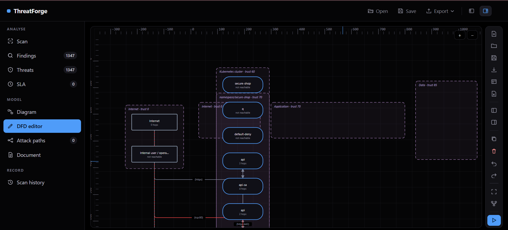

<div align="center">

# ThreatForge

**Threat modelling that produces evidence, not volume.**

Every finding cites the file and line that caused it. Every question it cannot
answer is reported as a question, not as a threat.

[](LICENSE)
[](https://www.python.org/)
[](DCO)

</div>



---

## What it is

A threat-modelling tool that reads your infrastructure definitions, builds a
data flow diagram from them, applies rules that fire only on evidence, and
tracks what you decide to do about the result.

It does three things that most tools do separately:

1. **Derives the diagram from the code.** Kubernetes manifests, Helm charts,
   Terraform, Dockerfiles and Compose files become components, flows and trust
   boundaries — so the picture matches what is deployed rather than what
   somebody drew eighteen months ago.
2. **Lets you draw what the code cannot show.** Third-party SaaS, human
   operators, on-premises systems, anything reached over a VPN. Drawn elements
   take part in reachability, blast radius and attack paths exactly like a
   scanned one.
3. **Asks the questions a reviewer would.** Does this sanitise input? Does that
   store hold credentials in the clear? Answers become findings with the answer
   as the evidence. Unanswered questions become coverage gaps.

---

## Why it exists

This project began as a replacement for a staged script pipeline that produced
**2,337 threats** from a single Kubernetes estate.

The number was not discovered. It was arithmetic: 254 processes × 6 STRIDE
letters, plus 29 stores × 3, plus 181 flows × 4, plus one external entity × 2.
Every count was determined before the parser had read a line of YAML. Nobody
triaged it, because a list that long is indistinguishable from noise.

ThreatForge inverts that. **A rule fires only when a fact extracted from a real
file satisfies a predicate.** The same estate produces a report a person can
work through, and each line of it names the file and line number that caused it.

The consequence worth stating plainly: **silence is not safety.** When nobody
has answered whether a component validates its input, that is recorded as an
unanswered question at info level — never as a passing check, and never as an
invented threat.

---

## Install

Isolated, always on PATH:

```bash
pipx install threatforge
```

Or from a clone, for development:

```bash
pip install -e .
```

One dependency: PyYAML. No build step, no npm, no framework. The workbook
writer, the web app and the diagram engine are all standard library, because a
security tool nobody can install is a security tool nobody runs.

---

## Quick start

```bash
threatforge serve /path/to/your/repo
```

Opens the app on `http://127.0.0.1:8787`. To begin with an empty slate:

```bash
threatforge serve /path/to/your/repo --fresh   # clears history, no startup scan
```

There is a sample model in `examples/`. Use **Open** in the header and pick
`minimal-app.tfm` — five components, one design flaw, ten findings you can trace
back to individual answers. `storefront-sample.tfm` is a larger one.

For CI:

```bash
threatforge scan .                # report to threatforge-out/
threatforge gate . --fail-on high # non-zero exit if anything high or worse is open
```

---

## The application

The screenshot above is the DFD editor. The layout is the same in every view:
navigation on the left, the work in the middle, a dock on the right, and an
action rail on the far edge that never scrolls away.

| View | What it is for |
|---|---|
| **Scan** | Point at a local folder, a git repository, or an uploaded zip |
| **Findings** | The full list, with owner, status, notes and SLA state per finding |
| **Threats** | The same findings arranged as a threat model: STRIDE, severity, CWE, MITRE technique |
| **SLA** | Compliance percentage, what is overdue, and by whom |
| **Diagram** | The model as scanned, with filters |
| **DFD editor** | Draw, connect, annotate, and re-analyse |
| **Attack paths** | Complete routes from an external entity to something worth reaching, as trees |
| **Document** | Title, owner, stakeholders, assumptions, and twelve security questions |
| **Scan history** | What changed between runs |

### The diagram surface

Both canvases share one implementation, so what you review is what you edited.

- Drag from a library of **56 component types** across nine categories
- **Orthogonal connectors** that leave from the side facing the target
- **Trust boundaries you draw as rectangles**, with membership decided
  geometrically — drag a service into the DMZ and it is in the DMZ
- Rulers, snap-to-grid, marquee select, align and distribute, undo and redo
- **Nodes are coloured by their worst open finding**, so the diagram is a heat
  map rather than a box drawing
- A red edge is unencrypted; a dashed edge means encryption could not be
  determined — a different claim, drawn differently

Layout is stored separately from the model, so nudging a shape is not a diff on
your threat model, and a re-scan never discards your arrangement.

---

## What makes a finding

```yaml
- id: TF-K8S-001
  title: Container runs in privileged mode
  severity: critical
  stride: [E, T, I]
  applies_to: {element: [process]}
  when:
    all:
      - {fact: container.privileged, op: is_true}
  evidence:
    - {fact: container.privileged, text: "privileged: true", expected: "false"}
```

`container.privileged` is extracted from a real manifest with its file and line.
If the key is absent, the rule does not fire — it does not assume, and it does
not guess.

**95 rules across nine packs:**

| Pack | Rules | Subject |
|---|---:|---|
| `k8s-workload` | 23 | Pods, containers, workload security context |
| `k8s-network` | 12 | Services, ingress, NetworkPolicy |
| `docker-build` | 12 | Dockerfiles and image provenance |
| `design` | 11 | Answers given in the DFD editor |
| `cloud-terraform` | 10 | Terraform resources |
| `k8s-data` | 8 | Secrets, ConfigMaps, volumes |
| `dataflow` | 7 | Edges: what crosses a boundary, and how |
| `k8s-identity` | 7 | RBAC and service accounts |
| `boundary` | 5 | The perimeter itself |

Rules evaluate **three kinds of subject**: components, flows, and trust
boundaries. Boundary rules answer questions no per-component rule can — how many
crossings there are, how many are plaintext, whether sensitive data sits within
reach of the outside.

### Design attributes

Each component carries TMT-style properties: does it sanitise input, what does it
run as, does it store credentials, is it encrypted at rest. **13 of them are read
by rules**, so an answer produces a finding that quotes the answer.

They are three-state on purpose. `null` means nobody has said, which is not the
same as `false`. A test asserts every attribute advertised as rule-bearing is
genuinely read by the rule it names, so the properties panel cannot rot into
decoration.

**Out of scope** marks a component excluded. Its findings are shown *suppressed
with your recorded reason* rather than never generated — an exclusion you can
see and argue with, not a silence.

---

## Risk scoring

Risk is likelihood × impact on a 1–25 scale, then adjusted by exposure, blast
radius, data sensitivity and detected controls. **Every adjustment is recorded**
in `RiskFactors.control_offsets` with a note, so a score can be argued with
rather than merely disputed.

Findings carry stable ids — `TF-<sha1(rule|component)>` — which is what makes
baselines, diffs and SLA clocks possible. The SLA clock starts when a finding
**first appeared**, not when somebody noticed it.

---

## Interoperability

| Format | Read | Write |
|---|:--:|:--:|
| Kubernetes, Helm, Kustomize | ✅ | |
| Terraform, Dockerfile, Compose | ✅ | |
| Microsoft TMT `.tm7` | ✅ | ✅ |
| draw.io `.drawio` | ✅ | ✅ |
| Interchange `.thf` | ✅ | ✅ |
| ThreatForge model `.tfm` | ✅ | ✅ |
| Excel workbook | | ✅ |
| Executive summary, HTML report, Markdown | | ✅ |
| SARIF, JSON, Mermaid | | ✅ |

`.tm7` support is written against the schema of a genuine Microsoft Threat
Modeling Tool export — element order, namespaces, enum members and
object-reference ids are pinned in a fixture and asserted by tests. No
third-party source code is included; see [docs/INTEROP.md](docs/INTEROP.md) for
the provenance statement.

**`.tfm`** is the save format: diagram, layout, attributes, document and triage
decisions in one plain-JSON file. Deliberately not a zip — a save format you
cannot diff in a pull request is one you cannot trust.

### For the people who fix things

- **Excel** — five sheets. The Threats sheet gives an engineer rule, severity,
  score, component, why it matters, CWE, MITRE, OWASP/NIST, what to do, and the
  evidence file and line.
- **Executive summary** — six numbered sections, including one that states
  plainly what the assessment does *not* cover. Unanswered design questions are
  reported as unanswered, never folded into the risk count.

---

## CI/CD

```yaml
- run: threatforge gate . --fail-on high --baseline .threatforge-baseline.json
```

Two modes. A **threshold gate** fails when anything at or above a severity is
open. A **ratchet gate** accepts today's findings as a baseline and fails only
on new ones — the honest way to adopt this on an estate that already has debt.

Exit codes: `0` pass, `1` gate failed, `2` usage error.

---

## Security of the app itself

It binds to `127.0.0.1`, never `0.0.0.0`, and three attacks are closed
explicitly:

- **DNS rebinding** — requests whose `Host` is not literally localhost are
  rejected
- **Cross-origin state change** — mutating routes require a per-session token
  present only in the served page
- **Analysing untrusted code** — Helm and Kustomize rendering execute logic from
  the repository being scanned, so both are disabled for git clones and uploads,
  and the UI says so

Git URLs are validated against a host allowlist before reaching a subprocess.
Archive members are resolved before extraction and refused if they escape.

---

## Tests

158 tests. Beyond the usual, they assert things that are easy to get wrong and
silent when wrong:

- The hardened fixture produces **zero** critical and high findings, so a rule
  that becomes noisy fails the build
- The page **boots in a real DOM** with no runtime errors — checking that
  JavaScript parses proves nothing about whether it runs
- The `.tm7` writer matches a real TMT export path by path, namespace by
  namespace, and uses only enum members a genuine file contains
- A saved layout **wins over auto-arrange**
- Every rule-bearing design attribute is read by the rule it advertises

```bash
pytest -q
npm install jsdom     # optional; the DOM specs skip without it
```

---

## Contributing

Pull requests need a DCO sign-off:

```bash
git commit -s -m "your message"
```

If you contribute code derived from another project, say so in the pull request.
It is almost always fine — permissive licences are permissive — but it has to be
declared so attribution is recorded correctly.

See [CONTRIBUTING.md](CONTRIBUTING.md) and [SECURITY.md](SECURITY.md).

---

## Licence

[Mozilla Public License 2.0](LICENSE).

You may use this commercially, privately, and inside proprietary products. If
you modify a file covered by the MPL and distribute it, **that file's changes
must be shared under the same licence**. Files you write yourself alongside it
stay yours. The obligation is per-file, not per-project — which is the point:
improvements to ThreatForge come back, your business logic does not have to.
