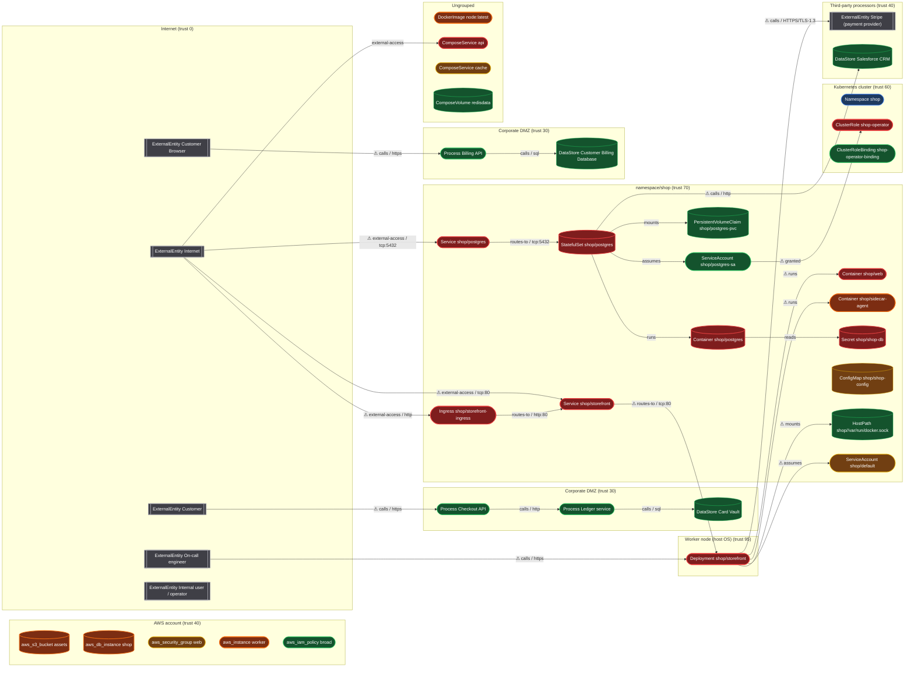
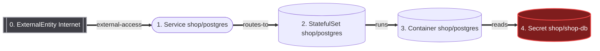
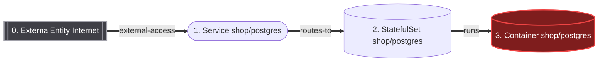
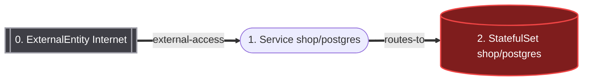
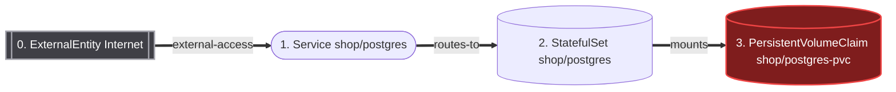
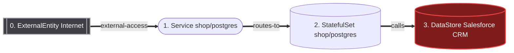

# Threat model — demo

*Generated 2026-08-10 by ThreatForge. Evidence-based STRIDE analysis of infrastructure-as-code.*

## Executive summary

This analysis modelled 38 assets and 24 data flows across 8 trust boundaries, and produced 75 evidence-backed findings. 17 are critical and 22 are high risk after adjusting for exposure and compensating controls. 25 assets are reachable from an untrusted network and 10 hold sensitive data. 9 complete attack paths were found; the highest-scoring one reaches Secret shop/shop-db in 4 hops.

| Risk level | Findings |
|---|---|
| Critical | 17 |
| High | 22 |
| Medium | 24 |
| Low | 12 |

### Control coverage

Across 2 workloads:

| Control | Coverage |
|---|---|
| Network Policy Ingress | 0% |
| Network Policy Egress | 0% |
| Non Root | 0% |
| Read Only Root Fs | 0% |
| Resource Limits | 0% |
| No Privilege Escalation | 0% |
| Seccomp | 0% |
| Pinned Images | 0% |
| Probes | 0% |
| Dedicated Service Account | 50% |

## Scope

- **Assets modelled:** 38
- **Data flows:** 24
- **Trust boundaries:** 8
- **Sources parsed:** kubernetes (2 files), terraform (1 files), dockerfile (1 files), compose (1 files), manual (1 files), tmt (1 files), drawio (1 files)

**Out of scope for this analysis:** application source code, image contents and CVEs, runtime behaviour, admission or mesh policy applied outside the scanned sources, and any resource created out-of-band. Absence of a finding here is not evidence that a risk does not exist.

## Trust boundaries

| Boundary | Kind | Trust | Assets | Notes |
|---|---|---|---|---|
| Internet | internet | 0 | 6 | Anonymous, unauthenticated, fully untrusted network. |
| Corporate DMZ | tmt-box | 30 | 2 | Trust boundary imported from a Microsoft TMT model (Corporate DMZ). |
| Corporate DMZ | drawio | 30 | 3 | Trust boundary from architecture.drawio (Payments architecture). |
| Third-party processors | manual | 40 | 2 | Outside our control. Contractual controls only; no technical enforcement. |
| AWS account | cloud-account | 40 | 5 | Managed aws resources. Trust is enforced by IAM, not by network position. |
| Kubernetes cluster | cluster | 60 | 17 | Everything inside the cluster network and API server. |
| namespace/shop | namespace | 70 | 14 | Application namespace. |
| Worker node (host OS) | node | 95 | 1 | Node filesystem, kubelet, and container runtime. Reaching here means the container boundary has been bypassed. |

## Data flow diagram



## Attack paths

Ranked chains from an untrusted entry point to an asset worth stealing. Each step is a real edge in the graph; the findings named are what make the step possible.

### AP-1: ExternalEntity Internet → Secret shop/shop-db

**Score 233** (critical) · 5 hops · 10 enabling findings

1. Attacker starts at ExternalEntity Internet.
1. Sends a request to Service shop/postgres, where service exposes an administrative or database port (TF-NET-008, risk 25) provides the next step.
1. Is routed to StatefulSet shop/postgres, where internet-reachable workload has no ingress networkpolicy (TF-NET-001, risk 20) provides the next step.
1. Pivots into Container shop/postgres, where container can escalate privileges (TF-K8S-002, risk 20) provides the next step.
1. Reads Secret shop/shop-db, where secret material committed to the repository (TF-DATA-001, risk 20) provides the next step.
1. Objective reached: Secret shop/shop-db (credential, pii, secret).



### AP-2: ExternalEntity Internet → Container shop/postgres

**Score 202** (critical) · 4 hops · 8 enabling findings

1. Attacker starts at ExternalEntity Internet.
1. Sends a request to Service shop/postgres, where service exposes an administrative or database port (TF-NET-008, risk 25) provides the next step.
1. Is routed to StatefulSet shop/postgres, where internet-reachable workload has no ingress networkpolicy (TF-NET-001, risk 20) provides the next step.
1. Pivots into Container shop/postgres, where container can escalate privileges (TF-K8S-002, risk 20) provides the next step.
1. Objective reached: Container shop/postgres (pii).



### AP-3: ExternalEntity Internet → ClusterRole shop-operator

**Score 159** (critical) · 5 hops · 7 enabling findings

1. Attacker starts at ExternalEntity Internet.
1. Sends a request to Service shop/postgres, where service exposes an administrative or database port (TF-NET-008, risk 25) provides the next step.
1. Is routed to StatefulSet shop/postgres, where internet-reachable workload has no ingress networkpolicy (TF-NET-001, risk 20) provides the next step.
1. Assumes the identity of ServiceAccount shop/postgres-sa.
1. Uses permissions from ClusterRole shop-operator, where clusterrole grants full cluster administration (TF-RBAC-001, risk 20) provides the next step.
1. Objective reached: ClusterRole shop-operator (privileged access).

```mermaid
flowchart LR

    classDef crit fill:#7f1d1d,stroke:#ef4444,stroke-width:2px,color:#fff;
    classDef high fill:#7c2d12,stroke:#f97316,stroke-width:2px,color:#fff;
    classDef med  fill:#713f12,stroke:#eab308,stroke-width:1px,color:#fff;
    classDef low  fill:#1e3a5f,stroke:#3b82f6,stroke-width:1px,color:#fff;
    classDef ok   fill:#14532d,stroke:#22c55e,stroke-width:1px,color:#fff;
    classDef ext  fill:#3f3f46,stroke:#a1a1aa,stroke-width:2px,color:#fff;
    n0[["0. ExternalEntity Internet"]]
    n1(["1. Service shop/postgres"])
    n2[("2. StatefulSet shop/postgres")]
    n3(["3. ServiceAccount shop/postgres-sa"])
    n4(["4. ClusterRole shop-operator"])
    n0 ==>|external-access| n1
    n1 ==>|routes-to| n2
    n2 ==>|assumes| n3
    n3 ==>|granted| n4
    class n0 ext;
    class n4 crit;
```



### AP-4: ExternalEntity Internet → StatefulSet shop/postgres

**Score 136** (critical) · 3 hops · 5 enabling findings

1. Attacker starts at ExternalEntity Internet.
1. Sends a request to Service shop/postgres, where service exposes an administrative or database port (TF-NET-008, risk 25) provides the next step.
1. Is routed to StatefulSet shop/postgres, where internet-reachable workload has no ingress networkpolicy (TF-NET-001, risk 20) provides the next step.
1. Objective reached: StatefulSet shop/postgres (pii).



### AP-5: ExternalEntity Internet → PersistentVolumeClaim shop/postgres-pvc

**Score 125** (critical) · 4 hops · 5 enabling findings

1. Attacker starts at ExternalEntity Internet.
1. Sends a request to Service shop/postgres, where service exposes an administrative or database port (TF-NET-008, risk 25) provides the next step.
1. Is routed to StatefulSet shop/postgres, where internet-reachable workload has no ingress networkpolicy (TF-NET-001, risk 20) provides the next step.
1. Reads the mounted PersistentVolumeClaim shop/postgres-pvc.
1. Objective reached: PersistentVolumeClaim shop/postgres-pvc (pii).



### AP-6: ExternalEntity Internet → DataStore Salesforce CRM

**Score 125** (critical) · 4 hops · 5 enabling findings

1. Attacker starts at ExternalEntity Internet.
1. Sends a request to Service shop/postgres, where service exposes an administrative or database port (TF-NET-008, risk 25) provides the next step.
1. Is routed to StatefulSet shop/postgres, where internet-reachable workload has no ingress networkpolicy (TF-NET-001, risk 20) provides the next step.
1. Calls DataStore Salesforce CRM.
1. Objective reached: DataStore Salesforce CRM (pii).



## STRIDE coverage

| Category | Findings | Highest risk |
|---|---|---|
| **S** Spoofing | 21 | 25 |
| **T** Tampering | 29 | 25 |
| **R** Repudiation | 0 | 0 |
| **I** Information Disclosure | 32 | 25 |
| **D** Denial of Service | 20 | 20 |
| **E** Elevation of Privilege | 30 | 25 |

## Findings

*Showing the 60 highest-risk of 75 findings. Full set in `threat-model.json`.*

### 25/25 · Compose service runs privileged

`TF-CMP-001` · **critical** · component `compose:service:api` · confidence *confirmed* · STRIDE E (Elevation of Privilege), T (Tampering)

ComposeService api runs with `privileged: true`, disabling container isolation entirely. Code execution in this service is equivalent to root on the host.

**Evidence**

- privileged: true (observed: `True`) — `docker-compose.yml:2`

**Risk** — likelihood 5 × impact 5 = 25. Exposure: 1 hop(s) from the internet; blast radius 0; data sensitivity 5.

- Directly reachable from the internet.
- Holds secret or credential material.

**Remediation** — Remove privileged; grant specific cap_add entries instead. *(effort: medium, breaking risk: medium)*

```yaml
privileged: false
cap_drop: ["ALL"]
cap_add: ["NET_BIND_SERVICE"]
```

**CWE** CWE-250 · **MITRE** T1611 · **NIST** AC-6

---

### 25/25 · Compose service mounts the Docker socket

`TF-CMP-002` · **critical** · component `compose:service:api` · confidence *confirmed* · STRIDE E (Elevation of Privilege), T (Tampering), I (Information Disclosure)

ComposeService api mounts /var/run/docker.sock. This grants full control of the Docker daemon, which is root on the host by another name.

**Evidence**

- docker.sock is mounted (observed: `True`) — `docker-compose.yml:2`

**Risk** — likelihood 5 × impact 5 = 25. Exposure: 1 hop(s) from the internet; blast radius 0; data sensitivity 5.

- Directly reachable from the internet.
- Holds secret or credential material.

**Remediation** — Use a socket proxy with a minimal API allowlist, or rootless Docker. *(effort: high, breaking risk: high)*

**CWE** CWE-250, CWE-284 · **MITRE** T1610 · **NIST** AC-6

---

### 25/25 · Compose service has plaintext credentials in environment

`TF-CMP-004` · **critical** · component `compose:service:api` · confidence *likely* · STRIDE I (Information Disclosure)

Credential-shaped environment variables are set inline in the compose file, which is version-controlled and visible to anyone who can run `docker inspect`.

**Evidence**

- credential-like env vars with literal values (observed: `True`) — `docker-compose.yml:2`

**Risk** — likelihood 5 × impact 5 = 25. Exposure: 1 hop(s) from the internet; blast radius 0; data sensitivity 5.

- Directly reachable from the internet.
- Holds secret or credential material.

**Remediation** — Move values to an untracked env_file or to Docker/Swarm secrets. *(effort: low, breaking risk: low)*

```yaml
env_file: [.env]      # add .env to .gitignore
# or, in swarm mode:
# secrets: [db_password]
```

**CWE** CWE-798 · **MITRE** T1552.001 · **NIST** IA-5

---

### 25/25 · Container runs in privileged mode

`TF-K8S-001` · **critical** · component `k8s:Container:shop/storefront/web` · confidence *confirmed* · STRIDE E (Elevation of Privilege), T (Tampering), I (Information Disclosure)

Container shop/web runs with `privileged: true`, which disables essentially every container isolation control: all Linux capabilities are granted, /dev is fully exposed, and AppArmor/seccomp are effectively bypassed. An attacker with code execution in this container can mount the host filesystem, write to /etc/kubernetes, read the kubelet credentials, and take over the node -- and from the node, every other pod scheduled on it.

**Evidence**

- securityContext.privileged is true (observed: `True`) — `k8s/app.yaml:23` at `spec.template.spec.containers[0].securityContext.privileged`

**Risk** — likelihood 5 × impact 5 = 25. Exposure: 3 hop(s) from the internet; blast radius 5; data sensitivity 1.

- Reachable from the internet in 3 hops.

**Remediation** — Remove privileged mode and grant only the specific capabilities needed. *(effort: medium, breaking risk: medium)*

Identify why privilege was needed. The usual culprits are raw sockets (NET_RAW), binding to ports below 1024 (NET_BIND_SERVICE), or device access. Grant those capabilities individually. If the workload genuinely needs host access (CNI plugin, node exporter), isolate it on dedicated nodes with taints and document the exception.

```yaml
securityContext:
  privileged: false
  allowPrivilegeEscalation: false
  capabilities:
    drop: ["ALL"]
    add: []            # add back only what is proven necessary
```

**CWE** CWE-250, CWE-269 · **MITRE** T1611, T1610 · **CIS** 5.2.1 · **NIST** AC-6, CM-7 · **OWASP** K01

---

### 25/25 · Container mounts the container runtime socket

`TF-K8S-004` · **critical** · component `k8s:Deployment:shop/storefront` · confidence *confirmed* · STRIDE E (Elevation of Privilege), T (Tampering), I (Information Disclosure)

Deployment shop/storefront mounts the Docker/containerd/CRI-O socket. This is equivalent to granting root on the node: anyone who can write to the socket can start a new privileged container with the host filesystem mounted. There is no meaningful sandbox left.

**Evidence**

- hostPath volume includes the runtime socket (observed: `['/var/run/docker.sock']`) — `k8s/app.yaml:7` at `spec.template.spec.volumes`

**Risk** — likelihood 5 × impact 5 = 25. Exposure: 2 hop(s) from the internet; blast radius 5; data sensitivity 1.

- Reachable from the internet in 2 hops.

**Remediation** — Remove the socket mount; use a rootless build tool or a proxy with an allowlist. *(effort: high, breaking risk: high)*

For image builds use Kaniko, Buildah rootless, or BuildKit with the rootless daemon. For log/metric collection use the kubelet API or the CRI API through a dedicated read-only proxy such as docker-socket-proxy with the API surface restricted to what the agent actually needs.

```yaml
# delete this volume and its volumeMount
# - name: docker-sock
#   hostPath:
#     path: /var/run/docker.sock
```

**CWE** CWE-250, CWE-284 · **MITRE** T1610, T1611 · **CIS** 5.2.4 · **NIST** AC-6, SC-7

---

### 25/25 · Plaintext credential in container environment variables

`TF-K8S-015` · **critical** · component `k8s:Container:shop/storefront/web` · confidence *likely* · STRIDE I (Information Disclosure), S (Spoofing)

Environment variables DB_PASSWORD, STRIPE_API_KEY on Container shop/web contain literal values and are named like credentials. Env vars are visible to anyone with `kubectl describe pod`, are captured in crash dumps and in most APM/error-tracking agents, are inherited by every child process, and are readable from /proc/<pid>/environ by anything sharing the PID namespace.

**Evidence**

- env vars with literal values: DB_PASSWORD, STRIPE_API_KEY (observed: `['DB_PASSWORD', 'STRIPE_API_KEY']`) — `k8s/app.yaml:23` at `spec.template.spec.containers[0].env`

**Risk** — likelihood 5 × impact 5 = 25. Exposure: 3 hop(s) from the internet; blast radius 5; data sensitivity 1.

- Reachable from the internet in 3 hops.

**Remediation** — Move the value into a Secret and reference it, or mount it as a file. *(effort: low, breaking risk: low)*

Files are preferable to env vars: they can be rotated without a pod restart and are not inherited by child processes. Best of all, source from an external secret manager (External Secrets Operator, Vault Agent, cloud CSI driver) so the material never lives in the cluster's etcd at all.

```yaml
env:
  - name: DB_PASSWORD
    valueFrom:
      secretKeyRef:
        name: app-db
        key: password
```

**CWE** CWE-798, CWE-522 · **MITRE** T1552.001, T1552.007 · **CIS** 5.4.1 · **NIST** IA-5, SC-28 · **OWASP** K08

---

### 25/25 · Ingress does not enforce TLS

`TF-NET-003` · **critical** · component `k8s:Ingress:shop/storefront-ingress` · confidence *confirmed* · STRIDE I (Information Disclosure), S (Spoofing), T (Tampering)

Ingress shop/storefront-ingress accepts traffic without TLS. Credentials, session cookies, and response data cross the public internet in cleartext, and there is nothing to stop an on-path attacker rewriting responses to serve malicious JavaScript.

**Evidence**

- spec.tls is absent (observed: `False`) — `k8s/app.yaml:63` at `spec.tls`
- hosts = *.shop.example.com (observed: `['*.shop.example.com']`) — `k8s/app.yaml:63`

**Risk** — likelihood 5 × impact 5 = 25. Exposure: 1 hop(s) from the internet; blast radius 7; data sensitivity 1.

- Directly reachable from the internet.

**Remediation** — Add a TLS block and force HTTPS redirection. *(effort: low, breaking risk: low)*

```yaml
metadata:
  annotations:
    nginx.ingress.kubernetes.io/force-ssl-redirect: "true"
    cert-manager.io/cluster-issuer: letsencrypt-prod
spec:
  tls:
    - hosts: ["app.example.com"]
      secretName: app-tls
```

**CWE** CWE-319, CWE-311 · **MITRE** T1040, T1557 · **CIS** 5.3.1 · **NIST** SC-8, SC-13 · **OWASP** K05

---

### 25/25 · Service exposes an administrative or database port

`TF-NET-008` · **critical** · component `k8s:Service:shop/postgres` · confidence *confirmed* · STRIDE I (Information Disclosure), E (Elevation of Privilege), T (Tampering)

Service shop/postgres exposes port(s) 5432 and is reachable from outside the cluster. Database, cache, and management ports (5432, 3306, 6379, 9200, 27017, 2375, 10250, 2379...) are routinely scanned; several of these protocols have no authentication enabled by default.

**Evidence**

- exposed admin/data ports: 5432 (observed: `[5432]`) — `k8s/app.yaml:129` at `spec.ports`
- service type = NodePort (observed: `NodePort`) — `k8s/app.yaml:129` at `spec.type`

**Risk** — likelihood 5 × impact 5 = 25. Exposure: 1 hop(s) from the internet; blast radius 7; data sensitivity 4.

- Directly reachable from the internet.
- Handles personal or otherwise regulated data.
- Has a path to a sensitive data store.

**Remediation** — Make the service ClusterIP and reach it through a bastion, VPN, or port-forward. *(effort: low, breaking risk: medium)*

```yaml
spec:
  type: ClusterIP     # not NodePort / LoadBalancer
```

**CWE** CWE-284, CWE-306 · **MITRE** T1133, T1046 · **NIST** SC-7, AC-3 · **OWASP** K05

---

### 20/25 · Secret material committed to the repository

`TF-DATA-001` · **critical** · component `k8s:Secret:shop/shop-db` · confidence *confirmed* · STRIDE I (Information Disclosure), S (Spoofing)

Secret shop/shop-db contains inline `data`/`stringData` in a manifest tracked in version control. base64 is an encoding, not encryption. Anyone with repository read access -- including every CI job, every fork, and the full git history after the value is "removed" -- has these credentials. Rotation is the only remedy once this has been pushed.

**Evidence**

- inline keys: password, username (observed: `['password', 'username']`) — `k8s/app.yaml:80`

**Risk** — likelihood 4 × impact 5 = 20. Exposure: 4 hop(s) from the internet; blast radius 0; data sensitivity 5.

- 4 hops from the internet; requires chaining.
- Holds secret or credential material.

**Remediation** — Rotate the credential, then source it from a secret manager. *(effort: medium, breaking risk: low)*

Order of operations matters: rotate first (assume it is compromised), then migrate. Use External Secrets Operator, Vault Agent Injector, Sealed Secrets, or SOPS with a KMS key. Scrub git history with git-filter-repo and force-rotate any credential that was ever pushed.

```yaml
apiVersion: external-secrets.io/v1beta1
kind: ExternalSecret
metadata:
  name: {{ name }}
  namespace: {{ namespace }}
spec:
  secretStoreRef: {name: vault-backend, kind: SecretStore}
  target: {name: {{ name }}}
  data:
    - secretKey: password
      remoteRef: {key: prod/db, property: password}
```

**CWE** CWE-798, CWE-540, CWE-312 · **MITRE** T1552.001, T1552.008 · **CIS** 5.4.1 · **NIST** IA-5, SC-28 · **OWASP** K08

---

### 20/25 · Unencrypted flow from the internet

`TF-FLOW-001` · **critical** · component `ext:internet--external-access-->k8s:Ingress:shop/storefront-ingress` · confidence *confirmed* · STRIDE I (Information Disclosure), T (Tampering), S (Spoofing)

ExternalEntity Internet -> Ingress shop/storefront-ingress carries traffic from an untrusted network without transport encryption. Anything on the path -- ISP, cloud provider network, a compromised intermediate -- can read and modify it.

**Evidence**

- protocol = http, encrypted = false (observed: `http`) — `k8s/app.yaml:63`

**Risk** — likelihood 5 × impact 4 = 20. Exposure: 0 hop(s) from the internet; blast radius 0; data sensitivity 1.

- Directly reachable from the internet.

**Remediation** — Terminate TLS at the edge and redirect plaintext. *(effort: low, breaking risk: low)*

**CWE** CWE-319 · **MITRE** T1040, T1557 · **NIST** SC-8 · **OWASP** K05

---

### 20/25 · Unencrypted flow from the internet

`TF-FLOW-001` · **critical** · component `ext:internet--external-access-->k8s:Service:shop/storefront` · confidence *confirmed* · STRIDE I (Information Disclosure), T (Tampering), S (Spoofing)

ExternalEntity Internet -> Service shop/storefront carries traffic from an untrusted network without transport encryption. Anything on the path -- ISP, cloud provider network, a compromised intermediate -- can read and modify it.

**Evidence**

- protocol = tcp:80, encrypted = false (observed: `tcp:80`) — `k8s/app.yaml:51`

**Risk** — likelihood 5 × impact 4 = 20. Exposure: 0 hop(s) from the internet; blast radius 0; data sensitivity 1.

- Directly reachable from the internet.

**Remediation** — Terminate TLS at the edge and redirect plaintext. *(effort: low, breaking risk: low)*

**CWE** CWE-319 · **MITRE** T1040, T1557 · **NIST** SC-8 · **OWASP** K05

---

### 20/25 · Container can escalate privileges

`TF-K8S-002` · **critical** · component `k8s:Container:shop/postgres/postgres` · confidence *confirmed* · STRIDE E (Elevation of Privilege)

allowPrivilegeEscalation is not set to false on Container shop/postgres. A setuid binary or a `sudo`-like helper inside the image can gain more privileges than its parent process, which turns a limited RCE into root inside the container and shortens the path to a container escape.

**Evidence**

- allowPrivilegeEscalation is unset or true — `k8s/app.yaml:115` at `spec.template.spec.containers[0].securityContext.allowPrivilegeEscalation`

**Risk** — likelihood 4 × impact 5 = 20. Exposure: 3 hop(s) from the internet; blast radius 6; data sensitivity 4.

- Reachable from the internet in 3 hops.
- Handles personal or otherwise regulated data.
- Has a path to a sensitive data store.

**Remediation** — Set allowPrivilegeEscalation to false. *(effort: low, breaking risk: low)*

```yaml
securityContext:
  allowPrivilegeEscalation: false
```

**CWE** CWE-269 · **MITRE** T1548 · **CIS** 5.2.5 · **NIST** AC-6

---

### 20/25 · Container runs as root

`TF-K8S-003` · **critical** · component `k8s:Container:shop/postgres/postgres` · confidence *likely* · STRIDE E (Elevation of Privilege), T (Tampering)

Container shop/postgres has no runAsNonRoot/runAsUser constraint, so it runs as UID 0 inside the container. Root in the container means write access to every file in the image, the ability to install tooling at runtime, and a materially easier escape if a kernel or runtime vulnerability is available.

**Evidence**

- runAsUser is unset or 0 — `k8s/app.yaml:115` at `spec.template.spec.containers[0].securityContext.runAsUser`
- runAsNonRoot is not true — `k8s/app.yaml:115` at `spec.template.spec.containers[0].securityContext.runAsNonRoot`

**Risk** — likelihood 4 × impact 5 = 20. Exposure: 3 hop(s) from the internet; blast radius 6; data sensitivity 4.

- Reachable from the internet in 3 hops.
- Handles personal or otherwise regulated data.
- Has a path to a sensitive data store.

**Remediation** — Run as a dedicated non-root UID. *(effort: medium, breaking risk: medium)*

Add a non-root user in the Dockerfile, then enforce it in the manifest. Setting runAsNonRoot alone makes the kubelet refuse to start an image whose USER is root, which surfaces the problem at deploy time rather than at audit time.

```yaml
securityContext:
  runAsNonRoot: true
  runAsUser: 10001
  runAsGroup: 10001
```

**CWE** CWE-250 · **MITRE** T1610 · **CIS** 5.2.6 · **NIST** AC-6 · **OWASP** K01

---

### 20/25 · Internet-reachable workload has no ingress NetworkPolicy

`TF-NET-001` · **critical** · component `k8s:Deployment:shop/storefront` · confidence *confirmed* · STRIDE S (Spoofing), T (Tampering), I (Information Disclosure), E (Elevation of Privilege)

Deployment shop/storefront is reachable from the internet and no NetworkPolicy restricts ingress to it. Kubernetes networking is flat by default, so once an attacker has code execution in any pod in the cluster they can reach this workload directly on its pod IP -- and this workload can reach everything else. Segmentation is the control that turns one compromised pod into one compromised pod rather than a cluster-wide incident.

**Evidence**

- no NetworkPolicy selects this workload for ingress (observed: `False`) — `k8s/app.yaml:7`
- hops from internet = 2 (observed: `2`) — `k8s/app.yaml:7`

**Risk** — likelihood 4 × impact 5 = 20. Exposure: 2 hop(s) from the internet; blast radius 5; data sensitivity 1.

- Reachable from the internet in 2 hops.

**Remediation** — Apply default-deny ingress in the namespace, then allow only required sources. *(effort: medium, breaking risk: medium)*

```yaml
apiVersion: networking.k8s.io/v1
kind: NetworkPolicy
metadata:
  name: default-deny-ingress
  namespace: {{ namespace }}
spec:
  podSelector: {}
  policyTypes: ["Ingress"]
---
apiVersion: networking.k8s.io/v1
kind: NetworkPolicy
metadata:
  name: allow-from-ingress-controller
  namespace: {{ namespace }}
spec:
  podSelector:
    matchLabels: {app: {{ name }}}
  policyTypes: ["Ingress"]
  ingress:
    - from:
        - namespaceSelector:
            matchLabels: {kubernetes.io/metadata.name: ingress-nginx}
      ports:
        - {protocol: TCP, port: 8080}
```

**CWE** CWE-923, CWE-1327 · **MITRE** T1210, T1046 · **CIS** 5.3.2 · **NIST** SC-7, AC-4 · **OWASP** K05

---

### 20/25 · Internet-reachable workload has no ingress NetworkPolicy

`TF-NET-001` · **critical** · component `k8s:StatefulSet:shop/postgres` · confidence *confirmed* · STRIDE S (Spoofing), T (Tampering), I (Information Disclosure), E (Elevation of Privilege)

StatefulSet shop/postgres is reachable from the internet and no NetworkPolicy restricts ingress to it. Kubernetes networking is flat by default, so once an attacker has code execution in any pod in the cluster they can reach this workload directly on its pod IP -- and this workload can reach everything else. Segmentation is the control that turns one compromised pod into one compromised pod rather than a cluster-wide incident.

**Evidence**

- no NetworkPolicy selects this workload for ingress (observed: `False`) — `k8s/app.yaml:99`
- hops from internet = 2 (observed: `2`) — `k8s/app.yaml:99`

**Risk** — likelihood 4 × impact 5 = 20. Exposure: 2 hop(s) from the internet; blast radius 6; data sensitivity 4.

- Reachable from the internet in 2 hops.
- Handles personal or otherwise regulated data.
- Has a path to a sensitive data store.

**Remediation** — Apply default-deny ingress in the namespace, then allow only required sources. *(effort: medium, breaking risk: medium)*

```yaml
apiVersion: networking.k8s.io/v1
kind: NetworkPolicy
metadata:
  name: default-deny-ingress
  namespace: {{ namespace }}
spec:
  podSelector: {}
  policyTypes: ["Ingress"]
---
apiVersion: networking.k8s.io/v1
kind: NetworkPolicy
metadata:
  name: allow-from-ingress-controller
  namespace: {{ namespace }}
spec:
  podSelector:
    matchLabels: {app: {{ name }}}
  policyTypes: ["Ingress"]
  ingress:
    - from:
        - namespaceSelector:
            matchLabels: {kubernetes.io/metadata.name: ingress-nginx}
      ports:
        - {protocol: TCP, port: 8080}
```

**CWE** CWE-923, CWE-1327 · **MITRE** T1210, T1046 · **CIS** 5.3.2 · **NIST** SC-7, AC-4 · **OWASP** K05

---

### 20/25 · LoadBalancer Service has no source IP restriction

`TF-NET-007` · **critical** · component `k8s:Service:shop/storefront` · confidence *confirmed* · STRIDE S (Spoofing), D (Denial of Service), I (Information Disclosure)

Service shop/storefront provisions a cloud load balancer with no loadBalancerSourceRanges, so it is reachable from the entire internet. This bypasses the ingress controller and therefore also bypasses any WAF, authentication, or rate limiting configured there.

**Evidence**

- type = LoadBalancer with no loadBalancerSourceRanges (observed: `LoadBalancer`) — `k8s/app.yaml:51` at `spec.type`
- ports = 80 (observed: `[80]`) — `k8s/app.yaml:51`

**Risk** — likelihood 5 × impact 4 = 20. Exposure: 1 hop(s) from the internet; blast radius 6; data sensitivity 1.

- Directly reachable from the internet.

**Remediation** — Restrict source ranges, or move the workload behind the ingress controller. *(effort: low, breaking risk: medium)*

```yaml
spec:
  type: LoadBalancer
  loadBalancerSourceRanges:
    - 203.0.113.0/24
```

**CWE** CWE-284 · **MITRE** T1133 · **NIST** SC-7, AC-4 · **OWASP** K05

---

### 20/25 · ClusterRole grants full cluster administration

`TF-RBAC-001` · **critical** · component `k8s:ClusterRole:default/shop-operator` · confidence *confirmed* · STRIDE E (Elevation of Privilege)

ClusterRole shop-operator grants `*` verbs on `*` resources cluster-wide. Any subject bound to it owns the cluster: it can read every Secret in every namespace, create privileged pods on any node, and modify admission webhooks to make the compromise persistent and invisible.

**Evidence**

- verbs include '*' (observed: `['*']`) — `k8s/app.yaml:156` at `rules`
- resources include '*' (observed: `['*']`) — `k8s/app.yaml:156` at `rules`

**Risk** — likelihood 4 × impact 5 = 20. Exposure: 4 hop(s) from the internet; blast radius 0; data sensitivity 1.

- 4 hops from the internet; requires chaining.

**Remediation** — Replace the wildcard role with an explicitly enumerated least-privilege role. *(effort: high, breaking risk: high)*

Derive the real permission set from audit logs (`audit2rbac` or the API server audit log filtered by the subject) rather than guessing. Bind cluster-admin only to break-glass identities that are MFA-gated and alerted on.

```yaml
rules:
  - apiGroups: ["apps"]
    resources: ["deployments"]
    verbs: ["get", "list", "watch", "update"]
```

**CWE** CWE-269, CWE-732 · **MITRE** T1078.004, T1098 · **CIS** 5.1.1 · **NIST** AC-6, AC-2 · **OWASP** K03

---

### 16/25 · Compose service publishes a port on all interfaces

`TF-CMP-003` · **high** · component `compose:service:api` · confidence *likely* · STRIDE S (Spoofing), I (Information Disclosure), D (Denial of Service)

ComposeService api publishes 8080:8080 without binding to a specific host IP, so the port is reachable on every interface -- including the public one on a cloud VM. Docker also writes iptables rules directly, which commonly bypasses host firewall configuration such as ufw.

**Evidence**

- ports = 8080:8080 (observed: `['8080:8080']`) — `docker-compose.yml:2`

**Risk** — likelihood 4 × impact 4 = 16. Exposure: 1 hop(s) from the internet; blast radius 0; data sensitivity 5.

- Directly reachable from the internet.
- Holds secret or credential material.

**Remediation** — Bind to localhost and front the service with a reverse proxy. *(effort: low, breaking risk: medium)*

```yaml
ports:
  - "127.0.0.1:8080:8080"
```

**CWE** CWE-668 · **MITRE** T1133 · **NIST** SC-7

---

### 16/25 · Container can escalate privileges

`TF-K8S-002` · **high** · component `k8s:Container:shop/storefront/sidecar-agent` · confidence *confirmed* · STRIDE E (Elevation of Privilege)

allowPrivilegeEscalation is not set to false on Container shop/sidecar-agent. A setuid binary or a `sudo`-like helper inside the image can gain more privileges than its parent process, which turns a limited RCE into root inside the container and shortens the path to a container escape.

**Evidence**

- allowPrivilegeEscalation is unset or true — `k8s/app.yaml:41` at `spec.template.spec.containers[1].securityContext.allowPrivilegeEscalation`

**Risk** — likelihood 4 × impact 4 = 16. Exposure: 3 hop(s) from the internet; blast radius 5; data sensitivity 1.

- Reachable from the internet in 3 hops.

**Remediation** — Set allowPrivilegeEscalation to false. *(effort: low, breaking risk: low)*

```yaml
securityContext:
  allowPrivilegeEscalation: false
```

**CWE** CWE-269 · **MITRE** T1548 · **CIS** 5.2.5 · **NIST** AC-6

---

### 16/25 · Container runs as root

`TF-K8S-003` · **high** · component `k8s:Container:shop/storefront/web` · confidence *likely* · STRIDE E (Elevation of Privilege), T (Tampering)

Container shop/web has no runAsNonRoot/runAsUser constraint, so it runs as UID 0 inside the container. Root in the container means write access to every file in the image, the ability to install tooling at runtime, and a materially easier escape if a kernel or runtime vulnerability is available.

**Evidence**

- runAsUser is unset or 0 (observed: `0`) — `k8s/app.yaml:23` at `spec.template.spec.containers[0].securityContext.runAsUser`
- runAsNonRoot is not true — `k8s/app.yaml:23` at `spec.template.spec.containers[0].securityContext.runAsNonRoot`

**Risk** — likelihood 4 × impact 4 = 16. Exposure: 3 hop(s) from the internet; blast radius 5; data sensitivity 1.

- Reachable from the internet in 3 hops.

**Remediation** — Run as a dedicated non-root UID. *(effort: medium, breaking risk: medium)*

Add a non-root user in the Dockerfile, then enforce it in the manifest. Setting runAsNonRoot alone makes the kubelet refuse to start an image whose USER is root, which surfaces the problem at deploy time rather than at audit time.

```yaml
securityContext:
  runAsNonRoot: true
  runAsUser: 10001
  runAsGroup: 10001
```

**CWE** CWE-250 · **MITRE** T1610 · **CIS** 5.2.6 · **NIST** AC-6 · **OWASP** K01

---

### 16/25 · Container runs as root

`TF-K8S-003` · **high** · component `k8s:Container:shop/storefront/sidecar-agent` · confidence *likely* · STRIDE E (Elevation of Privilege), T (Tampering)

Container shop/sidecar-agent has no runAsNonRoot/runAsUser constraint, so it runs as UID 0 inside the container. Root in the container means write access to every file in the image, the ability to install tooling at runtime, and a materially easier escape if a kernel or runtime vulnerability is available.

**Evidence**

- runAsUser is unset or 0 — `k8s/app.yaml:41` at `spec.template.spec.containers[1].securityContext.runAsUser`
- runAsNonRoot is not true — `k8s/app.yaml:41` at `spec.template.spec.containers[1].securityContext.runAsNonRoot`

**Risk** — likelihood 4 × impact 4 = 16. Exposure: 3 hop(s) from the internet; blast radius 5; data sensitivity 1.

- Reachable from the internet in 3 hops.

**Remediation** — Run as a dedicated non-root UID. *(effort: medium, breaking risk: medium)*

Add a non-root user in the Dockerfile, then enforce it in the manifest. Setting runAsNonRoot alone makes the kubelet refuse to start an image whose USER is root, which surfaces the problem at deploy time rather than at audit time.

```yaml
securityContext:
  runAsNonRoot: true
  runAsUser: 10001
  runAsGroup: 10001
```

**CWE** CWE-250 · **MITRE** T1610 · **CIS** 5.2.6 · **NIST** AC-6 · **OWASP** K01

---

### 16/25 · Pod shares the host network namespace

`TF-K8S-006` · **high** · component `k8s:Deployment:shop/storefront` · confidence *confirmed* · STRIDE S (Spoofing), I (Information Disclosure), T (Tampering)

Deployment shop/storefront runs with hostNetwork: true. The pod shares the node's network namespace, so it can sniff traffic destined for other pods on the node, bind to privileged node ports, bypass NetworkPolicy entirely (policies do not apply to host-network pods), and reach the kubelet on localhost:10250.

**Evidence**

- spec.hostNetwork is true (observed: `True`) — `k8s/app.yaml:7` at `spec.template.spec.hostNetwork`

**Risk** — likelihood 4 × impact 4 = 16. Exposure: 2 hop(s) from the internet; blast radius 5; data sensitivity 1.

- Reachable from the internet in 2 hops.

**Remediation** — Use the pod network and expose the workload through a Service. *(effort: medium, breaking risk: medium)*

```yaml
spec:
  hostNetwork: false
  dnsPolicy: ClusterFirst
```

**CWE** CWE-668 · **MITRE** T1040, T1610 · **CIS** 5.2.4 · **NIST** SC-7

---

### 16/25 · Pod shares the host PID or IPC namespace

`TF-K8S-007` · **high** · component `k8s:Deployment:shop/storefront` · confidence *confirmed* · STRIDE I (Information Disclosure), T (Tampering), E (Elevation of Privilege)

Sharing hostPID lets the container see and signal every process on the node, and read secrets from other processes' /proc/<pid>/environ. Sharing hostIPC exposes shared memory segments belonging to other workloads.

**Evidence**

- spec.hostPID (observed: `True`) — `k8s/app.yaml:7` at `spec.template.spec.hostPID`
- spec.hostIPC (observed: `False`) — `k8s/app.yaml:7` at `spec.template.spec.hostIPC`

**Risk** — likelihood 4 × impact 4 = 16. Exposure: 2 hop(s) from the internet; blast radius 5; data sensitivity 1.

- Reachable from the internet in 2 hops.

**Remediation** — Remove hostPID and hostIPC. *(effort: low, breaking risk: medium)*

```yaml
spec:
  hostPID: false
  hostIPC: false
```

**CWE** CWE-668 · **MITRE** T1057, T1611 · **CIS** 5.2.2, 5.2.3 · **NIST** SC-4

---

### 16/25 · Container adds dangerous Linux capabilities

`TF-K8S-008` · **high** · component `k8s:Container:shop/storefront/sidecar-agent` · confidence *confirmed* · STRIDE E (Elevation of Privilege), T (Tampering)

Container shop/sidecar-agent adds capabilities SYS_ADMIN, NET_RAW. SYS_ADMIN is close to full root; SYS_PTRACE allows reading memory of other processes; NET_ADMIN permits traffic redirection and ARP spoofing; SYS_MODULE allows loading kernel modules, which is a direct host takeover.

**Evidence**

- capabilities.add = SYS_ADMIN, NET_RAW (observed: `['SYS_ADMIN', 'NET_RAW']`) — `k8s/app.yaml:41` at `spec.template.spec.containers[1].securityContext.capabilities.add`

**Risk** — likelihood 4 × impact 4 = 16. Exposure: 3 hop(s) from the internet; blast radius 5; data sensitivity 1.

- Reachable from the internet in 3 hops.

**Remediation** — Drop ALL, then add back only the minimum. *(effort: low, breaking risk: medium)*

```yaml
securityContext:
  capabilities:
    drop: ["ALL"]
    add: ["NET_BIND_SERVICE"]   # example only
```

**CWE** CWE-250 · **MITRE** T1611 · **CIS** 5.2.8, 5.2.9 · **NIST** AC-6, CM-7

---

### 16/25 · NodePort service exposes the workload on every node

`TF-NET-009` · **high** · component `k8s:Service:shop/postgres` · confidence *likely* · STRIDE S (Spoofing), D (Denial of Service)

A NodePort opens the port on every node in the cluster. Whether that is internet-reachable depends entirely on node security groups, which are usually managed by a different team than the manifest -- so this is exposure you cannot verify from the manifest alone.

**Evidence**

- nodePorts = 30432 (observed: `[30432]`) — `k8s/app.yaml:129`

**Risk** — likelihood 4 × impact 4 = 16. Exposure: 1 hop(s) from the internet; blast radius 7; data sensitivity 4.

- Directly reachable from the internet.
- Handles personal or otherwise regulated data.
- Has a path to a sensitive data store.

**Remediation** — Prefer ClusterIP behind an Ingress; if NodePort is required, restrict node security groups. *(effort: medium, breaking risk: medium)*

**CWE** CWE-668 · **MITRE** T1133 · **NIST** SC-7

---

### 15/25 · Object storage bucket has a public ACL

`TF-CLOUD-001` · **high** · component `tf:aws_s3_bucket.assets` · confidence *confirmed* · STRIDE I (Information Disclosure)

aws_s3_bucket assets is configured with a public-read or public-read-write ACL. Public buckets are found by automated scanners within hours. public-read-write is worse than disclosure: anyone can also overwrite objects, which turns the bucket into a malware distribution point under your domain.

**Evidence**

- resource aws_s3_bucket with public ACL (observed: `aws_s3_bucket`) — `tf/main.tf:1` at `resource.aws_s3_bucket.assets`

**Risk** — likelihood 3 × impact 5 = 15. Exposure: unreachable from an external entity; blast radius 0; data sensitivity 4.

- No path from an external entity was found, so remote exploitation requires an existing foothold.
- Handles personal or otherwise regulated data.

**Remediation** — Set the ACL to private and enable the account-level public access block. *(effort: low, breaking risk: medium)*

```yaml
resource "aws_s3_bucket_public_access_block" "this" {
  bucket                  = aws_s3_bucket.this.id
  block_public_acls       = true
  block_public_policy     = true
  ignore_public_acls      = true
  restrict_public_buckets = true
}
```

**CWE** CWE-732, CWE-284 · **MITRE** T1530 · **NIST** AC-3, SC-28

---

### 15/25 · Database instance is publicly accessible

`TF-CLOUD-002` · **high** · component `tf:aws_db_instance.shop` · confidence *confirmed* · STRIDE I (Information Disclosure), E (Elevation of Privilege), D (Denial of Service)

aws_db_instance shop is assigned a public endpoint. Managed database endpoints are continuously scanned and brute-forced; combined with a weak or reused master password this is a direct route to the full dataset.

**Evidence**

- publicly_accessible = true (observed: `aws_db_instance`) — `tf/main.tf:5` at `resource.aws_db_instance.shop`

**Risk** — likelihood 3 × impact 5 = 15. Exposure: unreachable from an external entity; blast radius 0; data sensitivity 4.

- No path from an external entity was found, so remote exploitation requires an existing foothold.
- Handles personal or otherwise regulated data.

**Remediation** — Place the instance in private subnets and reach it through a bastion or VPN. *(effort: medium, breaking risk: high)*

```yaml
publicly_accessible = false
# and ensure db_subnet_group_name points at private subnets only
```

**CWE** CWE-284, CWE-668 · **MITRE** T1190, T1133 · **NIST** SC-7, AC-3

---

### 15/25 · Hardcoded credential in Terraform source

`TF-CLOUD-007` · **high** · component `tf:aws_db_instance.shop` · confidence *likely* · STRIDE I (Information Disclosure), S (Spoofing)

aws_db_instance shop has a credential-shaped attribute with a literal value. Terraform source is version-controlled, and any value here is also written in cleartext into the state file, which is frequently stored in a bucket with broader read access than the repository.

**Evidence**

- literal credential attribute detected (observed: `aws_db_instance`) — `tf/main.tf:5` at `resource.aws_db_instance.shop`

**Risk** — likelihood 3 × impact 5 = 15. Exposure: unreachable from an external entity; blast radius 0; data sensitivity 4.

- No path from an external entity was found, so remote exploitation requires an existing foothold.
- Handles personal or otherwise regulated data.

**Remediation** — Rotate the credential, move it to a secret manager, and encrypt remote state. *(effort: medium, breaking risk: low)*

```yaml
data "aws_secretsmanager_secret_version" "db" {
  secret_id = "prod/db/password"
}
# password = jsondecode(data.aws_secretsmanager_secret_version.db.secret_string)["password"]
```

**CWE** CWE-798 · **MITRE** T1552.001 · **NIST** IA-5, SC-28

---

### 15/25 · Hardcoded credential in Terraform source

`TF-CLOUD-007` · **high** · component `tf:aws_instance.worker` · confidence *likely* · STRIDE I (Information Disclosure), S (Spoofing)

aws_instance worker has a credential-shaped attribute with a literal value. Terraform source is version-controlled, and any value here is also written in cleartext into the state file, which is frequently stored in a bucket with broader read access than the repository.

**Evidence**

- literal credential attribute detected (observed: `aws_instance`) — `tf/main.tf:24` at `resource.aws_instance.worker`

**Risk** — likelihood 3 × impact 5 = 15. Exposure: unreachable from an external entity; blast radius 0; data sensitivity 1.

- No path from an external entity was found, so remote exploitation requires an existing foothold.

**Remediation** — Rotate the credential, move it to a secret manager, and encrypt remote state. *(effort: medium, breaking risk: low)*

```yaml
data "aws_secretsmanager_secret_version" "db" {
  secret_id = "prod/db/password"
}
# password = jsondecode(data.aws_secretsmanager_secret_version.db.secret_string)["password"]
```

**CWE** CWE-798 · **MITRE** T1552.001 · **NIST** IA-5, SC-28

---

### 15/25 · Secret is reachable from an internet-facing workload

`TF-DATA-003` · **high** · component `k8s:Secret:shop/shop-db` · confidence *likely* · STRIDE I (Information Disclosure)

Secret shop/shop-db is only 4 hops from the internet along the data-flow graph. An RCE in the internet-facing component in that chain yields this secret directly. This is not a misconfiguration on its own -- it is a statement about blast radius that should drive where you invest in detection.

**Evidence**

- shortest path from internet = 4 hops (observed: `4`) — `k8s/app.yaml:80`

**Risk** — likelihood 3 × impact 5 = 15. Exposure: 4 hop(s) from the internet; blast radius 0; data sensitivity 5.

- 4 hops from the internet; requires chaining.
- Holds secret or credential material.

**Remediation** — Shorten the trust chain -- scope the secret, or broker access through a short-lived token. *(effort: high, breaking risk: medium)*

Prefer workload identity (IRSA, Workload Identity, SPIFFE) over long-lived secrets. Where a static secret is unavoidable, scope it to the single consumer and rotate on a schedule short enough that theft has a bounded window.

**CWE** CWE-522 · **MITRE** T1552 · **NIST** SC-28, AC-6

---

### 15/25 · Secret material in build instructions

`TF-DKR-003` · **high** · component `docker:image:Dockerfile#node:latest` · confidence *likely* · STRIDE I (Information Disclosure)

DockerImage node:latest embeds credential-shaped values in ENV/ARG/RUN. Docker layers are immutable and independently pullable: deleting the value in a later layer does not remove it, and anyone who can pull the image can extract it with `docker history` or by unpacking the layer tarballs.

**Evidence**

- credential-like build instructions detected (observed: `[{'value': 'ARG NPM_TOKEN=***', 'line': 2}, {'value': 'ENV DB_PASSWORD=***', 'line': 5}]`) — `Dockerfile:2`

**Risk** — likelihood 3 × impact 5 = 15. Exposure: unreachable from an external entity; blast radius 0; data sensitivity 5.

- No path from an external entity was found, so remote exploitation requires an existing foothold.
- Holds secret or credential material.

**Remediation** — Rotate the credential and use BuildKit secret mounts. *(effort: medium, breaking risk: low)*

```yaml
# syntax=docker/dockerfile:1.7
RUN --mount=type=secret,id=npmrc,target=/root/.npmrc \
    npm ci --omit=dev
```

**CWE** CWE-798, CWE-540 · **MITRE** T1552.001 · **CIS** 4.10 · **NIST** IA-5

---

### 12/25 · Container does not drop all capabilities

`TF-K8S-009` · **high** · component `k8s:Container:shop/postgres/postgres` · confidence *confirmed* · STRIDE E (Elevation of Privilege)

Container shop/postgres keeps the default Docker capability set (CHOWN, DAC_OVERRIDE, FOWNER, SETUID, SETGID, NET_RAW and others). SETUID/SETGID enable local privilege escalation via setuid binaries; NET_RAW enables ARP/DNS spoofing against pods sharing the node network.

**Evidence**

- capabilities.drop does not include ALL (observed: `[]`) — `k8s/app.yaml:115` at `spec.template.spec.containers[0].securityContext.capabilities.drop`

**Risk** — likelihood 3 × impact 4 = 12. Exposure: 3 hop(s) from the internet; blast radius 6; data sensitivity 4.

- Reachable from the internet in 3 hops.
- Handles personal or otherwise regulated data.
- Has a path to a sensitive data store.

**Remediation** — Drop ALL capabilities as the baseline. *(effort: low, breaking risk: low)*

```yaml
securityContext:
  capabilities:
    drop: ["ALL"]
```

**CWE** CWE-250 · **MITRE** T1548 · **CIS** 5.2.9 · **NIST** CM-7

---

### 12/25 · Container root filesystem is writable

`TF-K8S-010` · **high** · component `k8s:Container:shop/postgres/postgres` · confidence *confirmed* · STRIDE T (Tampering)

A writable root filesystem lets an attacker with code execution drop a web shell, overwrite application binaries, or install persistence that survives a process restart. It also removes a cheap tripwire: with a read-only root, most post-exploitation tooling fails immediately and noisily.

**Evidence**

- readOnlyRootFilesystem is not true (observed: `False`) — `k8s/app.yaml:115` at `spec.template.spec.containers[0].securityContext.readOnlyRootFilesystem`

**Risk** — likelihood 3 × impact 4 = 12. Exposure: 3 hop(s) from the internet; blast radius 6; data sensitivity 4.

- Reachable from the internet in 3 hops.
- Handles personal or otherwise regulated data.
- Has a path to a sensitive data store.

**Remediation** — Make the root filesystem read-only and mount emptyDir for writable paths. *(effort: medium, breaking risk: medium)*

```yaml
securityContext:
  readOnlyRootFilesystem: true
volumeMounts:
  - name: tmp
    mountPath: /tmp
# volumes:
#   - name: tmp
#     emptyDir: {}
```

**CWE** CWE-732 · **MITRE** T1505.003, T1543 · **CIS** 5.2.11 · **NIST** SI-7

---

### 12/25 · Container has no CPU or memory limits

`TF-K8S-013` · **high** · component `k8s:Container:shop/postgres/postgres` · confidence *confirmed* · STRIDE D (Denial of Service)

Without resource limits, Container shop/postgres can consume all allocatable CPU and memory on its node. A memory leak or a deliberately expensive request becomes a node-wide outage: the kubelet begins evicting neighbouring pods, and a single compromised workload becomes a cluster-wide denial of service primitive.

**Evidence**

- resources.limits.cpu is unset (observed: `True`) — `k8s/app.yaml:115` at `spec.template.spec.containers[0].resources.limits.cpu`
- resources.limits.memory is unset (observed: `True`) — `k8s/app.yaml:115` at `spec.template.spec.containers[0].resources.limits.memory`

**Risk** — likelihood 3 × impact 4 = 12. Exposure: 3 hop(s) from the internet; blast radius 6; data sensitivity 4.

- Reachable from the internet in 3 hops.
- Handles personal or otherwise regulated data.
- Has a path to a sensitive data store.

**Remediation** — Set requests and limits; enforce defaults with a LimitRange. *(effort: low, breaking risk: medium)*

```yaml
resources:
  requests: {cpu: "100m", memory: "128Mi"}
  limits:   {cpu: "500m", memory: "512Mi"}
```

**CWE** CWE-770, CWE-400 · **MITRE** T1499 · **CIS** 5.7.3 · **NIST** SC-5 · **OWASP** K07

---

### 12/25 · Pod does not set a seccomp profile

`TF-K8S-014` · **high** · component `k8s:StatefulSet:shop/postgres` · confidence *confirmed* · STRIDE E (Elevation of Privilege)

No seccomp profile is applied, so the container may issue all ~350 syscalls. Most container escapes published in the last several years relied on syscalls that RuntimeDefault blocks outright.

**Evidence**

- securityContext.seccompProfile is unset or Unconfined — `k8s/app.yaml:99` at `spec.template.spec.securityContext.seccompProfile`

**Risk** — likelihood 3 × impact 4 = 12. Exposure: 2 hop(s) from the internet; blast radius 6; data sensitivity 4.

- Reachable from the internet in 2 hops.
- Handles personal or otherwise regulated data.
- Has a path to a sensitive data store.

**Remediation** — Apply the RuntimeDefault seccomp profile. *(effort: low, breaking risk: low)*

```yaml
spec:
  securityContext:
    seccompProfile:
      type: RuntimeDefault
```

**CWE** CWE-693 · **MITRE** T1611 · **CIS** 5.7.2 · **NIST** SI-16, CM-7

---

### 12/25 · Workload has no egress NetworkPolicy

`TF-NET-002` · **high** · component `k8s:StatefulSet:shop/postgres` · confidence *confirmed* · STRIDE I (Information Disclosure), E (Elevation of Privilege)

StatefulSet shop/postgres has unrestricted egress. That is the exfiltration path and the command-and-control path: a compromised pod can reach any external host, any internal service, and the cloud metadata endpoint at 169.254.169.254 to steal node IAM credentials.

**Evidence**

- no NetworkPolicy restricts egress (observed: `False`) — `k8s/app.yaml:99`

**Risk** — likelihood 3 × impact 4 = 12. Exposure: 2 hop(s) from the internet; blast radius 6; data sensitivity 4.

- Reachable from the internet in 2 hops.
- Handles personal or otherwise regulated data.
- Has a path to a sensitive data store.

**Remediation** — Default-deny egress; allow DNS plus the specific destinations required. *(effort: medium, breaking risk: high)*

```yaml
apiVersion: networking.k8s.io/v1
kind: NetworkPolicy
metadata:
  name: default-deny-egress
  namespace: {{ namespace }}
spec:
  podSelector: {}
  policyTypes: ["Egress"]
  egress:
    - to:
        - namespaceSelector: {matchLabels: {kubernetes.io/metadata.name: kube-system}}
      ports: [{protocol: UDP, port: 53}]
    - to:
        - ipBlock:
            cidr: 0.0.0.0/0
            except: ["169.254.169.254/32", "10.0.0.0/8"]
```

**CWE** CWE-1327 · **MITRE** T1041, T1552.005 · **CIS** 5.3.2 · **NIST** SC-7, AC-4 · **OWASP** K05

---

### 12/25 · Internet-facing Ingress has no authentication or rate limiting

`TF-NET-005` · **high** · component `k8s:Ingress:shop/storefront-ingress` · confidence *likely* · STRIDE S (Spoofing), D (Denial of Service)

Ingress shop/storefront-ingress is exposed to the internet with no ingress-level authentication and no rate limit. Whether that is acceptable depends on whether the backend authenticates -- but the absence of a rate limit is unconditionally a denial of service and credential-stuffing exposure.

**Evidence**

- no auth-* annotations (observed: `False`) — `k8s/app.yaml:63` at `metadata.annotations`
- no rate-limit annotations (observed: `False`) — `k8s/app.yaml:63`

**Risk** — likelihood 4 × impact 3 = 12. Exposure: 1 hop(s) from the internet; blast radius 7; data sensitivity 1.

- Directly reachable from the internet.

**Remediation** — Add rate limiting at the ingress; add edge authentication for non-public endpoints. *(effort: low, breaking risk: low)*

```yaml
metadata:
  annotations:
    nginx.ingress.kubernetes.io/limit-rps: "20"
    nginx.ingress.kubernetes.io/limit-connections: "10"
    # for internal tools:
    # nginx.ingress.kubernetes.io/auth-url: "https://oauth2-proxy.example.com/oauth2/auth"
```

**CWE** CWE-307, CWE-770 · **MITRE** T1110, T1499 · **NIST** SC-5, IA-2 · **OWASP** K07

---

### 12/25 · Ingress uses a wildcard host

`TF-NET-006` · **high** · component `k8s:Ingress:shop/storefront-ingress` · confidence *confirmed* · STRIDE S (Spoofing), T (Tampering)

A wildcard host binds this backend to every subdomain, which enables subdomain takeover chains and makes cookie scoping decisions unsafe -- a cookie set on *.example.com is readable by every other service under it.

**Evidence**

- hosts = *.shop.example.com (observed: `['*.shop.example.com']`) — `k8s/app.yaml:63`

**Risk** — likelihood 4 × impact 3 = 12. Exposure: 1 hop(s) from the internet; blast radius 7; data sensitivity 1.

- Directly reachable from the internet.

**Remediation** — List explicit hostnames. *(effort: low, breaking risk: low)*

**CWE** CWE-346 · **MITRE** T1584.001 · **NIST** SC-7

---

### 12/25 · Role can write Secrets

`TF-RBAC-005` · **high** · component `k8s:ClusterRole:default/shop-operator` · confidence *confirmed* · STRIDE T (Tampering), E (Elevation of Privilege)

Write access to Secrets allows an attacker to plant credentials that other workloads will trust -- for example replacing a TLS keypair or an image pull secret to redirect pulls to an attacker-controlled registry.

**Evidence**

- write verbs on secrets: * (observed: `['*']`) — `k8s/app.yaml:156` at `rules`

**Risk** — likelihood 3 × impact 4 = 12. Exposure: 4 hop(s) from the internet; blast radius 0; data sensitivity 1.

- 4 hops from the internet; requires chaining.

**Remediation** — Remove write access; provision Secrets through a controller instead. *(effort: medium, breaking risk: medium)*

**CWE** CWE-732 · **MITRE** T1098, T1552 · **NIST** AC-6, SC-28

---

### 10/25 · Compute instance permits IMDSv1

`TF-CLOUD-009` · **medium** · component `tf:aws_instance.worker` · confidence *confirmed* · STRIDE E (Elevation of Privilege), I (Information Disclosure)

aws_instance worker allows IMDSv1. An SSRF in any application on the instance reaches 169.254.169.254 with a single unauthenticated GET and returns the instance role's temporary credentials. IMDSv2's PUT-token requirement blocks the entire SSRF class.

**Evidence**

- http_tokens is not 'required' (observed: `False`) — `tf/main.tf:24` at `resource.aws_instance.worker`

**Risk** — likelihood 2 × impact 5 = 10. Exposure: unreachable from an external entity; blast radius 0; data sensitivity 1.

- No path from an external entity was found, so remote exploitation requires an existing foothold.

**Remediation** — Require IMDSv2 and lower the hop limit. *(effort: low, breaking risk: medium)*

```yaml
metadata_options {
  http_tokens                 = "required"
  http_endpoint               = "enabled"
  http_put_response_hop_limit = 1
}
```

**CWE** CWE-918, CWE-522 · **MITRE** T1552.005 · **NIST** SC-7, IA-5

---

### 10/25 · Image runs as root

`TF-DKR-001` · **medium** · component `docker:image:Dockerfile#node:latest` · confidence *confirmed* · STRIDE E (Elevation of Privilege)

The final stage of DockerImage node:latest has no USER instruction, so the image runs as UID 0. Every downstream consumer inherits that default -- an orchestrator has to opt out explicitly, and most manifests never do.

**Evidence**

- no USER instruction in the final stage — `Dockerfile:1`

**Risk** — likelihood 2 × impact 5 = 10. Exposure: unreachable from an external entity; blast radius 0; data sensitivity 5.

- No path from an external entity was found, so remote exploitation requires an existing foothold.
- Holds secret or credential material.

**Remediation** — Create and switch to a non-root user. *(effort: medium, breaking risk: medium)*

```yaml
RUN addgroup -g 10001 app && adduser -D -u 10001 -G app app
USER 10001:10001
```

**CWE** CWE-250 · **MITRE** T1610 · **CIS** 4.1 · **NIST** AC-6

---

### 10/25 · Build pipes remote script directly into a shell

`TF-DKR-005` · **medium** · component `docker:image:Dockerfile#node:latest` · confidence *confirmed* · STRIDE T (Tampering), E (Elevation of Privilege)

A `curl ... | sh` pattern executes unverified remote code as root during the build. Whoever controls that URL controls the contents of your image, and the compromise leaves no trace in the Dockerfile.

**Evidence**

- curl/wget piped to a shell (observed: `[{'value': 'curl -fsSL https://get.example.com/install.sh | sh', 'line': 3}]`) — `Dockerfile:3`

**Risk** — likelihood 2 × impact 5 = 10. Exposure: unreachable from an external entity; blast radius 0; data sensitivity 5.

- No path from an external entity was found, so remote exploitation requires an existing foothold.
- Holds secret or credential material.

**Remediation** — Download, verify the checksum, inspect, then execute. *(effort: low, breaking risk: low)*

**CWE** CWE-494 · **MITRE** T1195.002, T1059 · **NIST** SI-7, CM-7

---

### 9/25 · Compose service has no resource limits

`TF-CMP-005` · **medium** · component `compose:service:api` · confidence *confirmed* · STRIDE D (Denial of Service)

No CPU or memory limit is set, so this container can exhaust the host.

**Evidence**

- deploy.resources.limits is unset (observed: `True`) — `docker-compose.yml:2`

**Risk** — likelihood 3 × impact 3 = 9. Exposure: 1 hop(s) from the internet; blast radius 0; data sensitivity 5.

- Directly reachable from the internet.
- Holds secret or credential material.

**Remediation** — Set deploy.resources.limits. *(effort: low, breaking risk: low)*

```yaml
deploy:
  resources:
    limits: {cpus: "0.50", memory: 512M}
```

**CWE** CWE-770 · **MITRE** T1499 · **NIST** SC-5

---

### 9/25 · Sensitive data crosses a trust boundary

`TF-FLOW-002` · **medium** · component `k8s:Deployment:shop/storefront--calls-->manual:payment-provider` · confidence *likely* · STRIDE I (Information Disclosure), T (Tampering)

Deployment shop/storefront -> ExternalEntity Stripe (payment provider) moves data classified as pci across a trust boundary. Each boundary crossing is a place where authentication, authorisation, encryption, and logging all need to be re-established -- assumptions that held on one side rarely hold on the other.

**Evidence**

- crosses boundary:node (observed: `boundary:node`) — `threatforge-overlay.yml:8` at `data_flows[0]`
- carries pci (observed: `['pci']`) — `threatforge-overlay.yml:8` at `data_flows[0]`

**Risk** — likelihood 3 × impact 3 = 9. Exposure: 2 hop(s) from the internet; blast radius 0; data sensitivity 1.

- Reachable from the internet in 2 hops.

**Remediation** — Enforce mTLS and explicit authorisation on this hop; log both sides. *(effort: high, breaking risk: medium)*

A service mesh (Istio, Linkerd) gives mTLS and per-hop authorisation policy without application changes, and produces the flow-level telemetry you need to detect abuse of this path.

**CWE** CWE-311, CWE-306 · **MITRE** T1557, T1041 · **NIST** SC-8, AC-4

---

### 9/25 · Sensitive data crosses a trust boundary

`TF-FLOW-002` · **medium** · component `k8s:StatefulSet:shop/postgres--calls-->manual:crm-saas` · confidence *likely* · STRIDE I (Information Disclosure), T (Tampering)

StatefulSet shop/postgres -> DataStore Salesforce CRM moves data classified as pii across a trust boundary. Each boundary crossing is a place where authentication, authorisation, encryption, and logging all need to be re-established -- assumptions that held on one side rarely hold on the other.

**Evidence**

- crosses boundary:namespace:shop (observed: `boundary:namespace:shop`) — `threatforge-overlay.yml:8` at `data_flows[1]`
- carries pii (observed: `['pii']`) — `threatforge-overlay.yml:8` at `data_flows[1]`

**Risk** — likelihood 3 × impact 3 = 9. Exposure: 2 hop(s) from the internet; blast radius 0; data sensitivity 1.

- Reachable from the internet in 2 hops.

**Remediation** — Enforce mTLS and explicit authorisation on this hop; log both sides. *(effort: high, breaking risk: medium)*

A service mesh (Istio, Linkerd) gives mTLS and per-hop authorisation policy without application changes, and produces the flow-level telemetry you need to detect abuse of this path.

**CWE** CWE-311, CWE-306 · **MITRE** T1557, T1041 · **NIST** SC-8, AC-4

---

### 9/25 · Container root filesystem is writable

`TF-K8S-010` · **medium** · component `k8s:Container:shop/storefront/web` · confidence *confirmed* · STRIDE T (Tampering)

A writable root filesystem lets an attacker with code execution drop a web shell, overwrite application binaries, or install persistence that survives a process restart. It also removes a cheap tripwire: with a read-only root, most post-exploitation tooling fails immediately and noisily.

**Evidence**

- readOnlyRootFilesystem is not true (observed: `False`) — `k8s/app.yaml:23` at `spec.template.spec.containers[0].securityContext.readOnlyRootFilesystem`

**Risk** — likelihood 3 × impact 3 = 9. Exposure: 3 hop(s) from the internet; blast radius 5; data sensitivity 1.

- Reachable from the internet in 3 hops.

**Remediation** — Make the root filesystem read-only and mount emptyDir for writable paths. *(effort: medium, breaking risk: medium)*

```yaml
securityContext:
  readOnlyRootFilesystem: true
volumeMounts:
  - name: tmp
    mountPath: /tmp
# volumes:
#   - name: tmp
#     emptyDir: {}
```

**CWE** CWE-732 · **MITRE** T1505.003, T1543 · **CIS** 5.2.11 · **NIST** SI-7

---

### 9/25 · Container root filesystem is writable

`TF-K8S-010` · **medium** · component `k8s:Container:shop/storefront/sidecar-agent` · confidence *confirmed* · STRIDE T (Tampering)

A writable root filesystem lets an attacker with code execution drop a web shell, overwrite application binaries, or install persistence that survives a process restart. It also removes a cheap tripwire: with a read-only root, most post-exploitation tooling fails immediately and noisily.

**Evidence**

- readOnlyRootFilesystem is not true (observed: `False`) — `k8s/app.yaml:41` at `spec.template.spec.containers[1].securityContext.readOnlyRootFilesystem`

**Risk** — likelihood 3 × impact 3 = 9. Exposure: 3 hop(s) from the internet; blast radius 5; data sensitivity 1.

- Reachable from the internet in 3 hops.

**Remediation** — Make the root filesystem read-only and mount emptyDir for writable paths. *(effort: medium, breaking risk: medium)*

```yaml
securityContext:
  readOnlyRootFilesystem: true
volumeMounts:
  - name: tmp
    mountPath: /tmp
# volumes:
#   - name: tmp
#     emptyDir: {}
```

**CWE** CWE-732 · **MITRE** T1505.003, T1543 · **CIS** 5.2.11 · **NIST** SI-7

---

### 9/25 · Container image uses a mutable tag

`TF-K8S-011` · **medium** · component `k8s:Container:shop/storefront/web` · confidence *confirmed* · STRIDE T (Tampering), S (Spoofing)

Container shop/web references image `shop/storefront:latest` by a mutable tag. What runs in production is therefore whatever the registry served at pull time. This breaks reproducibility, defeats admission-time image scanning, and makes supply chain tampering hard to detect -- an attacker who can push to the registry can replace the image without any manifest change.

**Evidence**

- image = shop/storefront:latest (observed: `shop/storefront:latest`) — `k8s/app.yaml:23` at `spec.template.spec.containers[0].image`

**Risk** — likelihood 3 × impact 3 = 9. Exposure: 3 hop(s) from the internet; blast radius 5; data sensitivity 1.

- Reachable from the internet in 3 hops.

**Remediation** — Pin images by digest. *(effort: low, breaking risk: low)*

```yaml
image: myrepo/myapp@sha256:0f6a...   # digest, not :latest
imagePullPolicy: IfNotPresent
```

**CWE** CWE-494, CWE-829 · **MITRE** T1525, T1195.002 · **CIS** 5.1.4 · **NIST** SI-7, CM-2 · **OWASP** K06

---

### 9/25 · Container image uses a mutable tag

`TF-K8S-011` · **medium** · component `k8s:Container:shop/storefront/sidecar-agent` · confidence *confirmed* · STRIDE T (Tampering), S (Spoofing)

Container shop/sidecar-agent references image `vendor/agent` by a mutable tag. What runs in production is therefore whatever the registry served at pull time. This breaks reproducibility, defeats admission-time image scanning, and makes supply chain tampering hard to detect -- an attacker who can push to the registry can replace the image without any manifest change.

**Evidence**

- image = vendor/agent (observed: `vendor/agent`) — `k8s/app.yaml:41` at `spec.template.spec.containers[1].image`

**Risk** — likelihood 3 × impact 3 = 9. Exposure: 3 hop(s) from the internet; blast radius 5; data sensitivity 1.

- Reachable from the internet in 3 hops.

**Remediation** — Pin images by digest. *(effort: low, breaking risk: low)*

```yaml
image: myrepo/myapp@sha256:0f6a...   # digest, not :latest
imagePullPolicy: IfNotPresent
```

**CWE** CWE-494, CWE-829 · **MITRE** T1525, T1195.002 · **CIS** 5.1.4 · **NIST** SI-7, CM-2 · **OWASP** K06

---

### 9/25 · Container has no CPU or memory limits

`TF-K8S-013` · **medium** · component `k8s:Container:shop/storefront/web` · confidence *confirmed* · STRIDE D (Denial of Service)

Without resource limits, Container shop/web can consume all allocatable CPU and memory on its node. A memory leak or a deliberately expensive request becomes a node-wide outage: the kubelet begins evicting neighbouring pods, and a single compromised workload becomes a cluster-wide denial of service primitive.

**Evidence**

- resources.limits.cpu is unset (observed: `True`) — `k8s/app.yaml:23` at `spec.template.spec.containers[0].resources.limits.cpu`
- resources.limits.memory is unset (observed: `True`) — `k8s/app.yaml:23` at `spec.template.spec.containers[0].resources.limits.memory`

**Risk** — likelihood 3 × impact 3 = 9. Exposure: 3 hop(s) from the internet; blast radius 5; data sensitivity 1.

- Reachable from the internet in 3 hops.

**Remediation** — Set requests and limits; enforce defaults with a LimitRange. *(effort: low, breaking risk: medium)*

```yaml
resources:
  requests: {cpu: "100m", memory: "128Mi"}
  limits:   {cpu: "500m", memory: "512Mi"}
```

**CWE** CWE-770, CWE-400 · **MITRE** T1499 · **CIS** 5.7.3 · **NIST** SC-5 · **OWASP** K07

---

### 9/25 · Container has no CPU or memory limits

`TF-K8S-013` · **medium** · component `k8s:Container:shop/storefront/sidecar-agent` · confidence *confirmed* · STRIDE D (Denial of Service)

Without resource limits, Container shop/sidecar-agent can consume all allocatable CPU and memory on its node. A memory leak or a deliberately expensive request becomes a node-wide outage: the kubelet begins evicting neighbouring pods, and a single compromised workload becomes a cluster-wide denial of service primitive.

**Evidence**

- resources.limits.cpu is unset (observed: `True`) — `k8s/app.yaml:41` at `spec.template.spec.containers[1].resources.limits.cpu`
- resources.limits.memory is unset (observed: `True`) — `k8s/app.yaml:41` at `spec.template.spec.containers[1].resources.limits.memory`

**Risk** — likelihood 3 × impact 3 = 9. Exposure: 3 hop(s) from the internet; blast radius 5; data sensitivity 1.

- Reachable from the internet in 3 hops.

**Remediation** — Set requests and limits; enforce defaults with a LimitRange. *(effort: low, breaking risk: medium)*

```yaml
resources:
  requests: {cpu: "100m", memory: "128Mi"}
  limits:   {cpu: "500m", memory: "512Mi"}
```

**CWE** CWE-770, CWE-400 · **MITRE** T1499 · **CIS** 5.7.3 · **NIST** SC-5 · **OWASP** K07

---

### 9/25 · Pod does not set a seccomp profile

`TF-K8S-014` · **medium** · component `k8s:Deployment:shop/storefront` · confidence *confirmed* · STRIDE E (Elevation of Privilege)

No seccomp profile is applied, so the container may issue all ~350 syscalls. Most container escapes published in the last several years relied on syscalls that RuntimeDefault blocks outright.

**Evidence**

- securityContext.seccompProfile is unset or Unconfined — `k8s/app.yaml:7` at `spec.template.spec.securityContext.seccompProfile`

**Risk** — likelihood 3 × impact 3 = 9. Exposure: 2 hop(s) from the internet; blast radius 5; data sensitivity 1.

- Reachable from the internet in 2 hops.

**Remediation** — Apply the RuntimeDefault seccomp profile. *(effort: low, breaking risk: low)*

```yaml
spec:
  securityContext:
    seccompProfile:
      type: RuntimeDefault
```

**CWE** CWE-693 · **MITRE** T1611 · **CIS** 5.7.2 · **NIST** SI-16, CM-7

---

### 9/25 · Workload uses the default service account

`TF-K8S-016` · **medium** · component `k8s:Deployment:shop/storefront` · confidence *confirmed* · STRIDE E (Elevation of Privilege), S (Spoofing)

Deployment shop/storefront runs as the namespace `default` service account with its token automounted. The default SA is shared by every workload in the namespace, so any permission granted to it is granted to all of them, and token theft cannot be attributed to a specific workload.

**Evidence**

- serviceAccountName is 'default' (observed: `default`) — `k8s/app.yaml:7` at `spec.template.spec.serviceAccountName`
- automountServiceAccountToken is not disabled — `k8s/app.yaml:7` at `spec.template.spec.automountServiceAccountToken`

**Risk** — likelihood 3 × impact 3 = 9. Exposure: 2 hop(s) from the internet; blast radius 5; data sensitivity 1.

- Reachable from the internet in 2 hops.

**Remediation** — Create a dedicated ServiceAccount per workload; disable automount if the API is not used. *(effort: low, breaking risk: low)*

```yaml
spec:
  serviceAccountName: myapp
  automountServiceAccountToken: false   # if the pod never calls the API server
```

**CWE** CWE-250, CWE-269 · **MITRE** T1528, T1078.004 · **CIS** 5.1.5, 5.1.6 · **NIST** AC-2, AC-6 · **OWASP** K03

---

### 9/25 · Container binds a host port

`TF-K8S-018` · **medium** · component `k8s:Container:shop/storefront/web` · confidence *confirmed* · STRIDE S (Spoofing), I (Information Disclosure), D (Denial of Service)

Container shop/web binds host port(s) 8080. The service is reachable on every node IP, bypassing Service-level controls and NetworkPolicy, and it constrains scheduling in ways that make node-level firewalling brittle.

**Evidence**

- hostPort = 8080 (observed: `[8080]`) — `k8s/app.yaml:23` at `spec.template.spec.containers[0].ports`

**Risk** — likelihood 3 × impact 3 = 9. Exposure: 3 hop(s) from the internet; blast radius 5; data sensitivity 1.

- Reachable from the internet in 3 hops.

**Remediation** — Expose through a Service and an Ingress instead of a host port. *(effort: medium, breaking risk: medium)*

**CWE** CWE-668 · **MITRE** T1571 · **CIS** 5.2.4 · **NIST** SC-7

---

### 9/25 · Workload has no egress NetworkPolicy

`TF-NET-002` · **medium** · component `k8s:Deployment:shop/storefront` · confidence *confirmed* · STRIDE I (Information Disclosure), E (Elevation of Privilege)

Deployment shop/storefront has unrestricted egress. That is the exfiltration path and the command-and-control path: a compromised pod can reach any external host, any internal service, and the cloud metadata endpoint at 169.254.169.254 to steal node IAM credentials.

**Evidence**

- no NetworkPolicy restricts egress (observed: `False`) — `k8s/app.yaml:7`

**Risk** — likelihood 3 × impact 3 = 9. Exposure: 2 hop(s) from the internet; blast radius 5; data sensitivity 1.

- Reachable from the internet in 2 hops.

**Remediation** — Default-deny egress; allow DNS plus the specific destinations required. *(effort: medium, breaking risk: high)*

```yaml
apiVersion: networking.k8s.io/v1
kind: NetworkPolicy
metadata:
  name: default-deny-egress
  namespace: {{ namespace }}
spec:
  podSelector: {}
  policyTypes: ["Egress"]
  egress:
    - to:
        - namespaceSelector: {matchLabels: {kubernetes.io/metadata.name: kube-system}}
      ports: [{protocol: UDP, port: 53}]
    - to:
        - ipBlock:
            cidr: 0.0.0.0/0
            except: ["169.254.169.254/32", "10.0.0.0/8"]
```

**CWE** CWE-1327 · **MITRE** T1041, T1552.005 · **CIS** 5.3.2 · **NIST** SC-7, AC-4 · **OWASP** K05

---

### 9/25 · Service account token automounted on the default service account

`TF-RBAC-007` · **medium** · component `k8s:ServiceAccount:shop/default` · confidence *confirmed* · STRIDE E (Elevation of Privilege)

The `default` ServiceAccount in namespace shop automounts its token into every pod that does not specify another SA. This is the most commonly abused foothold for lateral movement inside a namespace.

**Evidence**

- automountServiceAccountToken is not false — `<implicit>` at `automountServiceAccountToken`

**Risk** — likelihood 3 × impact 3 = 9. Exposure: 3 hop(s) from the internet; blast radius 5; data sensitivity 1.

- Reachable from the internet in 3 hops.

**Remediation** — Disable automount on the default service account. *(effort: low, breaking risk: medium)*

```yaml
apiVersion: v1
kind: ServiceAccount
metadata:
  name: default
  namespace: {{ namespace }}
automountServiceAccountToken: false
```

**CWE** CWE-522 · **MITRE** T1528 · **CIS** 5.1.5 · **NIST** AC-6

---

### 8/25 · Security group allows ingress from 0.0.0.0/0

`TF-CLOUD-003` · **medium** · component `tf:aws_security_group.web` · confidence *confirmed* · STRIDE S (Spoofing), D (Denial of Service), E (Elevation of Privilege)

aws_security_group web permits inbound traffic from the entire internet on port(s) 22. If any of those are 22, 3389, 3306, 5432, or 6379 this is immediately exploitable; even for 443 it removes the option of IP-based containment during an incident.

**Evidence**

- open ports = 22 from 0.0.0.0/0 (observed: `[22]`) — `tf/main.tf:14` at `resource.aws_security_group.web`

**Risk** — likelihood 2 × impact 4 = 8. Exposure: unreachable from an external entity; blast radius 0; data sensitivity 1.

- No path from an external entity was found, so remote exploitation requires an existing foothold.

**Remediation** — Restrict to known CIDRs, or front the service with a load balancer and WAF. *(effort: low, breaking risk: medium)*

```yaml
ingress {
  from_port   = 443
  to_port     = 443
  protocol    = "tcp"
  cidr_blocks = ["203.0.113.0/24"]
}
```

**CWE** CWE-284 · **MITRE** T1190, T1133 · **NIST** SC-7, AC-4

---

### 8/25 · Data store has encryption at rest disabled

`TF-CLOUD-004` · **medium** · component `tf:aws_db_instance.shop` · confidence *confirmed* · STRIDE I (Information Disclosure)

aws_db_instance shop stores data unencrypted at rest. Snapshot sharing, disk decommissioning, and support access all become disclosure paths, and most compliance regimes treat this as a reportable control failure on its own.

**Evidence**

- encryption is explicitly disabled (observed: `False`) — `tf/main.tf:5` at `resource.aws_db_instance.shop`

**Risk** — likelihood 2 × impact 4 = 8. Exposure: unreachable from an external entity; blast radius 0; data sensitivity 4.

- No path from an external entity was found, so remote exploitation requires an existing foothold.
- Handles personal or otherwise regulated data.

**Remediation** — Enable encryption with a customer-managed KMS key. *(effort: medium, breaking risk: high)*

```yaml
storage_encrypted = true
kms_key_id        = aws_kms_key.data.arn
```

**CWE** CWE-311 · **MITRE** T1530 · **NIST** SC-28

---

### 8/25 · Compose service uses host networking

`TF-CMP-006` · **medium** · component `compose:service:cache` · confidence *confirmed* · STRIDE S (Spoofing), I (Information Disclosure)

network_mode host removes network namespace isolation: the container can bind any host port and sniff all host traffic.

**Evidence**

- network_mode: host (observed: `True`) — `docker-compose.yml:11`

**Risk** — likelihood 2 × impact 4 = 8. Exposure: unreachable from an external entity; blast radius 0; data sensitivity 1.

- No path from an external entity was found, so remote exploitation requires an existing foothold.

**Remediation** — Use a user-defined bridge network and publish only required ports. *(effort: medium, breaking risk: medium)*

**CWE** CWE-668 · **MITRE** T1040 · **NIST** SC-7

---

### 8/25 · Credential-like values stored in a ConfigMap

`TF-DATA-002` · **medium** · component `k8s:ConfigMap:shop/shop-config` · confidence *likely* · STRIDE I (Information Disclosure)

ConfigMap shop/shop-config holds keys API_TOKEN that look like credentials. ConfigMaps get none of the (already modest) protections Secrets receive: they are not candidates for encryption at rest by default, are routinely granted broad read access, and are frequently dumped wholesale into logs and support bundles.

**Evidence**

- credential-like keys: API_TOKEN (observed: `['API_TOKEN']`) — `k8s/app.yaml:90`

**Risk** — likelihood 2 × impact 4 = 8. Exposure: unreachable from an external entity; blast radius 0; data sensitivity 2.

- No path from an external entity was found, so remote exploitation requires an existing foothold.

**Remediation** — Move these keys into a Secret or an external secret store, and rotate them. *(effort: low, breaking risk: low)*

**CWE** CWE-522, CWE-312 · **MITRE** T1552.001 · **NIST** SC-28, IA-5 · **OWASP** K08

---

## Parse warnings

- `[ingest.drawio]` 4 shape(s) on 'Payments architecture' were typed by shape style rather than declared. Add `tfType=process|data_store|external_entity` to the shape, or prefix the label, to be explicit. — architecture.drawio
